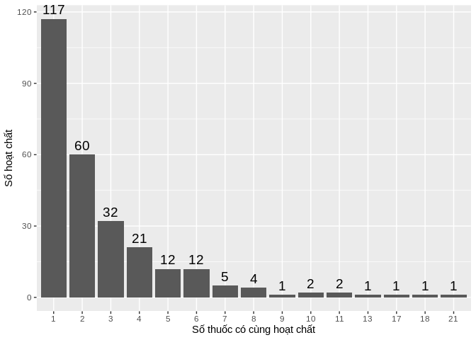

So luong hoat chat su dung tu nam 2011 den nam 2017
---------------------------------------------------

``` r
ggplot(sl_thuoc_cung_hoat_chat, aes(x=as.factor(sl_thuoc_cung_hoat_chat), y=value)) +
  geom_bar(stat = "identity") +
  stat_summary(aes(label=round(..y..,2)), fun.y=sum, geom="text", size=5, vjust = -0.5) +
  xlab("Số thuốc có cùng hoạt chất") + 
  ylab("Số hoạt chất")
```



Cac hoat chat co co so tan duoc su dung nhieu nhat tu nam 2014 - 2018
---------------------------------------------------------------------

``` r
knitr::kable(hoatchat_cs, format="html", 
             col.names = c("Hoat chat", "Co so thuoc (2014-2018)", "% Co so (2014-2018)",
                           "Co so thuoc (2018)", "% Co so (2018)"))
```

<table>
<thead>
<tr>
<th style="text-align:left;">
Hoat chat
</th>
<th style="text-align:right;">
Co so thuoc (2014-2018)
</th>
<th style="text-align:right;">
% Co so (2014-2018)
</th>
<th style="text-align:right;">
Co so thuoc (2018)
</th>
<th style="text-align:right;">
% Co so (2018)
</th>
</tr>
</thead>
<tbody>
<tr>
<td style="text-align:left;">
deferipron
</td>
<td style="text-align:right;">
4552087.0
</td>
<td style="text-align:right;">
19.9781039
</td>
<td style="text-align:right;">
971714
</td>
<td style="text-align:right;">
21.4300286
</td>
</tr>
<tr>
<td style="text-align:left;">
acidfolic
</td>
<td style="text-align:right;">
2588768.0
</td>
<td style="text-align:right;">
11.3615307
</td>
<td style="text-align:right;">
551141
</td>
<td style="text-align:right;">
12.1547774
</td>
</tr>
<tr>
<td style="text-align:left;">
hydroxycarbamid
</td>
<td style="text-align:right;">
1789203.0
</td>
<td style="text-align:right;">
7.8524166
</td>
<td style="text-align:right;">
365397
</td>
<td style="text-align:right;">
8.0584083
</td>
</tr>
<tr>
<td style="text-align:left;">
methylprednisolon
</td>
<td style="text-align:right;">
1614135.0
</td>
<td style="text-align:right;">
7.0840818
</td>
<td style="text-align:right;">
377478
</td>
<td style="text-align:right;">
8.3248408
</td>
</tr>
<tr>
<td style="text-align:left;">
deferasirox
</td>
<td style="text-align:right;">
765279.0
</td>
<td style="text-align:right;">
3.3586404
</td>
<td style="text-align:right;">
190084
</td>
<td style="text-align:right;">
4.1920828
</td>
</tr>
<tr>
<td style="text-align:left;">
imatinib
</td>
<td style="text-align:right;">
740406.0
</td>
<td style="text-align:right;">
3.2494783
</td>
<td style="text-align:right;">
313659
</td>
<td style="text-align:right;">
6.9173865
</td>
</tr>
<tr>
<td style="text-align:left;">
vitamin\_b1\_b6\_b1
</td>
<td style="text-align:right;">
586685.0
</td>
<td style="text-align:right;">
2.5748308
</td>
<td style="text-align:right;">
42672
</td>
<td style="text-align:right;">
0.9410816
</td>
</tr>
<tr>
<td style="text-align:left;">
mercaptopurin
</td>
<td style="text-align:right;">
581798.0
</td>
<td style="text-align:right;">
2.5533829
</td>
<td style="text-align:right;">
85219
</td>
<td style="text-align:right;">
1.8794065
</td>
</tr>
<tr>
<td style="text-align:left;">
omeprazol
</td>
<td style="text-align:right;">
527170.0
</td>
<td style="text-align:right;">
2.3136326
</td>
<td style="text-align:right;">
98825
</td>
<td style="text-align:right;">
2.1794711
</td>
</tr>
<tr>
<td style="text-align:left;">
natri\_clorid
</td>
<td style="text-align:right;">
446669.0
</td>
<td style="text-align:right;">
1.9603315
</td>
<td style="text-align:right;">
97533
</td>
<td style="text-align:right;">
2.1509775
</td>
</tr>
<tr>
<td style="text-align:left;">
spironolacton
</td>
<td style="text-align:right;">
330313.0
</td>
<td style="text-align:right;">
1.4496708
</td>
<td style="text-align:right;">
64669
</td>
<td style="text-align:right;">
1.4262000
</td>
</tr>
<tr>
<td style="text-align:left;">
kali\_clorid
</td>
<td style="text-align:right;">
314421.0
</td>
<td style="text-align:right;">
1.3799243
</td>
<td style="text-align:right;">
70634
</td>
<td style="text-align:right;">
1.5577512
</td>
</tr>
<tr>
<td style="text-align:left;">
diosmine\_hesperidin
</td>
<td style="text-align:right;">
296984.0
</td>
<td style="text-align:right;">
1.3033971
</td>
<td style="text-align:right;">
42884
</td>
<td style="text-align:right;">
0.9457570
</td>
</tr>
<tr>
<td style="text-align:left;">
ciclosporin
</td>
<td style="text-align:right;">
280192.0
</td>
<td style="text-align:right;">
1.2297008
</td>
<td style="text-align:right;">
25468
</td>
<td style="text-align:right;">
0.5616673
</td>
</tr>
<tr>
<td style="text-align:left;">
deferoxamin
</td>
<td style="text-align:right;">
279656.0
</td>
<td style="text-align:right;">
1.2273484
</td>
<td style="text-align:right;">
23887
</td>
<td style="text-align:right;">
0.5268002
</td>
</tr>
<tr>
<td style="text-align:left;">
methotrexat
</td>
<td style="text-align:right;">
269325.5
</td>
<td style="text-align:right;">
1.1820101
</td>
<td style="text-align:right;">
68350
</td>
<td style="text-align:right;">
1.5073802
</td>
</tr>
<tr>
<td style="text-align:left;">
biphenyl\_dimethyl\_dicarboxylat
</td>
<td style="text-align:right;">
261932.0
</td>
<td style="text-align:right;">
1.1495617
</td>
<td style="text-align:right;">
NA
</td>
<td style="text-align:right;">
NA
</td>
</tr>
<tr>
<td style="text-align:left;">
dexamethason
</td>
<td style="text-align:right;">
252135.0
</td>
<td style="text-align:right;">
1.1065648
</td>
<td style="text-align:right;">
35040
</td>
<td style="text-align:right;">
0.7727667
</td>
</tr>
<tr>
<td style="text-align:left;">
amlodipin
</td>
<td style="text-align:right;">
221223.0
</td>
<td style="text-align:right;">
0.9708989
</td>
<td style="text-align:right;">
19427
</td>
<td style="text-align:right;">
0.4284400
</td>
</tr>
<tr>
<td style="text-align:left;">
sulfamethoxazole\_trimethoprim
</td>
<td style="text-align:right;">
219774.0
</td>
<td style="text-align:right;">
0.9645395
</td>
<td style="text-align:right;">
44221
</td>
<td style="text-align:right;">
0.9752430
</td>
</tr>
</tbody>
</table>
Chi phi hoat chat su dung tu nam 2014 - 2018
--------------------------------------------
