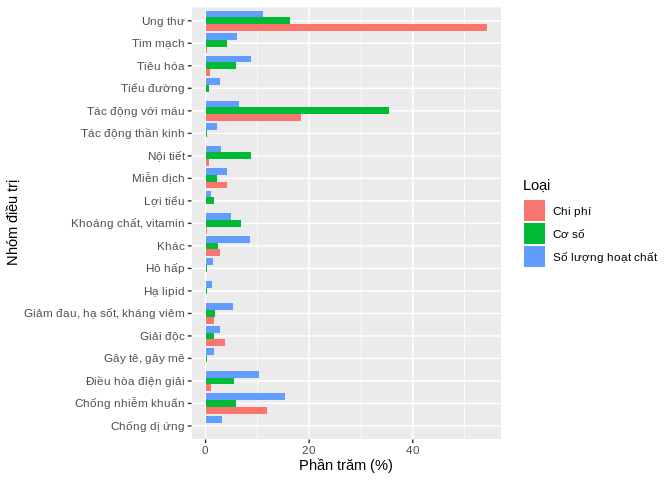

CO SO THUOC
-----------

**So luong thuoc duoc su dung theo nhom dieu tri tu nam 2014 den 2018 (5 nhom dieu tri co so luong thuoc su dung cao nhat)**

``` r
knitr::kable(nhomdieutri_cs_thuoc, format="html", 
             col.names = c("Nhom DT", "Co so thuoc", "%"))
```

<table>
<thead>
<tr>
<th style="text-align:left;">
Nhom DT
</th>
<th style="text-align:right;">
Co so thuoc
</th>
<th style="text-align:right;">
%
</th>
</tr>
</thead>
<tbody>
<tr>
<td style="text-align:left;">
Tác động với máu
</td>
<td style="text-align:right;">
8072625
</td>
<td style="text-align:right;">
35.428967
</td>
</tr>
<tr>
<td style="text-align:left;">
Ung thư
</td>
<td style="text-align:right;">
3723194
</td>
<td style="text-align:right;">
16.340278
</td>
</tr>
<tr>
<td style="text-align:left;">
Nội tiết
</td>
<td style="text-align:right;">
1996621
</td>
<td style="text-align:right;">
8.762728
</td>
</tr>
<tr>
<td style="text-align:left;">
Khoáng chất, vitamin
</td>
<td style="text-align:right;">
1537847
</td>
<td style="text-align:right;">
6.749271
</td>
</tr>
<tr>
<td style="text-align:left;">
Tiêu hóa
</td>
<td style="text-align:right;">
1350981
</td>
<td style="text-align:right;">
5.929157
</td>
</tr>
</tbody>
</table>
**Co so thuoc theo nhom dieu tri nam 2014**

``` r
knitr::kable(nhomdieutri_cs_thuoc_nam_2014, format="html", 
             col.names = c("Nhom DT", "Co so thuoc", "%"))
```

<table>
<thead>
<tr>
<th style="text-align:left;">
Nhom DT
</th>
<th style="text-align:right;">
Co so thuoc
</th>
<th style="text-align:right;">
%
</th>
</tr>
</thead>
<tbody>
<tr>
<td style="text-align:left;">
Khoáng chất, vitamin
</td>
<td style="text-align:right;">
339936.3
</td>
<td style="text-align:right;">
7.569538
</td>
</tr>
<tr>
<td style="text-align:left;">
Nội tiết
</td>
<td style="text-align:right;">
377818.0
</td>
<td style="text-align:right;">
8.413069
</td>
</tr>
<tr>
<td style="text-align:left;">
Tác động với máu
</td>
<td style="text-align:right;">
1473496.0
</td>
<td style="text-align:right;">
32.811098
</td>
</tr>
<tr>
<td style="text-align:left;">
Tiêu hóa
</td>
<td style="text-align:right;">
405799.0
</td>
<td style="text-align:right;">
9.036136
</td>
</tr>
<tr>
<td style="text-align:left;">
Ung thư
</td>
<td style="text-align:right;">
541288.0
</td>
<td style="text-align:right;">
12.053140
</td>
</tr>
</tbody>
</table>
**Co so thuoc theo nhom dieu tri nam 2015**

``` r
knitr::kable(nhomdieutri_cs_thuoc_nam_2015, format="html", 
             col.names = c("Nhom DT", "Co so thuoc", "%"))
```

<table>
<thead>
<tr>
<th style="text-align:left;">
Nhom DT
</th>
<th style="text-align:right;">
Co so thuoc
</th>
<th style="text-align:right;">
%
</th>
</tr>
</thead>
<tbody>
<tr>
<td style="text-align:left;">
Khoáng chất, vitamin
</td>
<td style="text-align:right;">
318341.7
</td>
<td style="text-align:right;">
7.486898
</td>
</tr>
<tr>
<td style="text-align:left;">
Nội tiết
</td>
<td style="text-align:right;">
364502.0
</td>
<td style="text-align:right;">
8.572515
</td>
</tr>
<tr>
<td style="text-align:left;">
Tác động với máu
</td>
<td style="text-align:right;">
1516995.0
</td>
<td style="text-align:right;">
35.677343
</td>
</tr>
<tr>
<td style="text-align:left;">
Tiêu hóa
</td>
<td style="text-align:right;">
268178.0
</td>
<td style="text-align:right;">
6.307126
</td>
</tr>
<tr>
<td style="text-align:left;">
Ung thư
</td>
<td style="text-align:right;">
564020.5
</td>
<td style="text-align:right;">
13.264878
</td>
</tr>
</tbody>
</table>
**Co so thuoc theo nhom dieu tri nam 2016**

``` r
knitr::kable(nhomdieutri_cs_thuoc_nam_2016, format="html", 
             col.names = c("Nhom DT", "Co so thuoc", "%"))
```

<table>
<thead>
<tr>
<th style="text-align:left;">
Nhom DT
</th>
<th style="text-align:right;">
Co so thuoc
</th>
<th style="text-align:right;">
%
</th>
</tr>
</thead>
<tbody>
<tr>
<td style="text-align:left;">
Khoáng chất, vitamin
</td>
<td style="text-align:right;">
444620.0
</td>
<td style="text-align:right;">
8.911198
</td>
</tr>
<tr>
<td style="text-align:left;">
Nội tiết
</td>
<td style="text-align:right;">
397608.2
</td>
<td style="text-align:right;">
7.968975
</td>
</tr>
<tr>
<td style="text-align:left;">
Tác động với máu
</td>
<td style="text-align:right;">
1772300.0
</td>
<td style="text-align:right;">
35.520930
</td>
</tr>
<tr>
<td style="text-align:left;">
Tiêu hóa
</td>
<td style="text-align:right;">
229777.5
</td>
<td style="text-align:right;">
4.605265
</td>
</tr>
<tr>
<td style="text-align:left;">
Ung thư
</td>
<td style="text-align:right;">
845201.0
</td>
<td style="text-align:right;">
16.939754
</td>
</tr>
</tbody>
</table>
**Co so thuoc theo nhom dieu tri nam 2017**

``` r
knitr::kable(nhomdieutri_cs_thuoc_nam_2017, format="html", 
             col.names = c("Nhom DT", "Co so thuoc", "%"))
```

<table>
<thead>
<tr>
<th style="text-align:left;">
Nhom DT
</th>
<th style="text-align:right;">
Co so thuoc
</th>
<th style="text-align:right;">
%
</th>
</tr>
</thead>
<tbody>
<tr>
<td style="text-align:left;">
Khoáng chất, vitamin
</td>
<td style="text-align:right;">
284715.0
</td>
<td style="text-align:right;">
6.300760
</td>
</tr>
<tr>
<td style="text-align:left;">
Nội tiết
</td>
<td style="text-align:right;">
416393.8
</td>
<td style="text-align:right;">
9.214819
</td>
</tr>
<tr>
<td style="text-align:left;">
Tác động với máu
</td>
<td style="text-align:right;">
1555250.0
</td>
<td style="text-align:right;">
34.417778
</td>
</tr>
<tr>
<td style="text-align:left;">
Tiêu hóa
</td>
<td style="text-align:right;">
238967.5
</td>
<td style="text-align:right;">
5.288366
</td>
</tr>
<tr>
<td style="text-align:left;">
Ung thư
</td>
<td style="text-align:right;">
842743.0
</td>
<td style="text-align:right;">
18.649955
</td>
</tr>
</tbody>
</table>
**Co so thuoc theo nhom dieu tri nam 2018**

``` r
knitr::kable(nhomdieutri_cs_thuoc_nam_2018, format="html", 
             col.names = c("Nhom DT", "Co so thuoc", "%"))
```

<table>
<thead>
<tr>
<th style="text-align:left;">
Nhom DT
</th>
<th style="text-align:right;">
Co so thuoc
</th>
<th style="text-align:right;">
%
</th>
</tr>
</thead>
<tbody>
<tr>
<td style="text-align:left;">
Khoáng chất, vitamin
</td>
<td style="text-align:right;">
150234
</td>
<td style="text-align:right;">
3.313237
</td>
</tr>
<tr>
<td style="text-align:left;">
Nội tiết
</td>
<td style="text-align:right;">
440299
</td>
<td style="text-align:right;">
9.710285
</td>
</tr>
<tr>
<td style="text-align:left;">
Tác động với máu
</td>
<td style="text-align:right;">
1754584
</td>
<td style="text-align:right;">
38.695321
</td>
</tr>
<tr>
<td style="text-align:left;">
Tiêu hóa
</td>
<td style="text-align:right;">
208259
</td>
<td style="text-align:right;">
4.592911
</td>
</tr>
<tr>
<td style="text-align:left;">
Ung thư
</td>
<td style="text-align:right;">
929942
</td>
<td style="text-align:right;">
20.508795
</td>
</tr>
</tbody>
</table>
SO LUONG HOAT CHAT
------------------

**So luong hoat chat duoc su dung theo nhom dieu tri tu nam 2014 den 2018 (5 nhom dieu tri co so luong hoat chat cao nhat)**

``` r
knitr::kable(nhomdieutri_sl_hoatchat, format="html", 
             col.names = c("Nhom DT", "SL hoat chat", "%"))
```

<table>
<thead>
<tr>
<th style="text-align:left;">
Nhom DT
</th>
<th style="text-align:right;">
SL hoat chat
</th>
<th style="text-align:right;">
%
</th>
</tr>
</thead>
<tbody>
<tr>
<td style="text-align:left;">
Chống nhiễm khuẩn
</td>
<td style="text-align:right;">
63
</td>
<td style="text-align:right;">
15.403423
</td>
</tr>
<tr>
<td style="text-align:left;">
Ung thư
</td>
<td style="text-align:right;">
45
</td>
<td style="text-align:right;">
11.002445
</td>
</tr>
<tr>
<td style="text-align:left;">
Điều hòa điện giải
</td>
<td style="text-align:right;">
42
</td>
<td style="text-align:right;">
10.268949
</td>
</tr>
<tr>
<td style="text-align:left;">
Tiêu hóa
</td>
<td style="text-align:right;">
36
</td>
<td style="text-align:right;">
8.801956
</td>
</tr>
<tr>
<td style="text-align:left;">
Khác
</td>
<td style="text-align:right;">
35
</td>
<td style="text-align:right;">
8.557457
</td>
</tr>
</tbody>
</table>
**So luong hoat chat duoc su dung theo nhom dieu tri tu nam 2014**

``` r
knitr::kable(nhomdieutri_hoatchat_nam_2014, format="html", 
             col.names = c("Nhom DT", "SL hoat chat", "%"))
```

<table>
<thead>
<tr>
<th style="text-align:left;">
Nhom DT
</th>
<th style="text-align:right;">
SL hoat chat
</th>
<th style="text-align:right;">
%
</th>
</tr>
</thead>
<tbody>
<tr>
<td style="text-align:left;">
Chống nhiễm khuẩn
</td>
<td style="text-align:right;">
50
</td>
<td style="text-align:right;">
15.015015
</td>
</tr>
<tr>
<td style="text-align:left;">
Điều hòa điện giải
</td>
<td style="text-align:right;">
31
</td>
<td style="text-align:right;">
9.309309
</td>
</tr>
<tr>
<td style="text-align:left;">
Khác
</td>
<td style="text-align:right;">
25
</td>
<td style="text-align:right;">
7.507508
</td>
</tr>
<tr>
<td style="text-align:left;">
Tiêu hóa
</td>
<td style="text-align:right;">
29
</td>
<td style="text-align:right;">
8.708709
</td>
</tr>
<tr>
<td style="text-align:left;">
Ung thư
</td>
<td style="text-align:right;">
36
</td>
<td style="text-align:right;">
10.810811
</td>
</tr>
</tbody>
</table>
**So luong hoat chat duoc su dung theo nhom dieu tri tu nam 2015**

``` r
knitr::kable(nhomdieutri_hoatchat_nam_2015, format="html", 
             col.names = c("Nhom DT", "SL hoat chat", "%"))
```

<table>
<thead>
<tr>
<th style="text-align:left;">
Nhom DT
</th>
<th style="text-align:right;">
SL hoat chat
</th>
<th style="text-align:right;">
%
</th>
</tr>
</thead>
<tbody>
<tr>
<td style="text-align:left;">
Chống nhiễm khuẩn
</td>
<td style="text-align:right;">
45
</td>
<td style="text-align:right;">
14.802632
</td>
</tr>
<tr>
<td style="text-align:left;">
Điều hòa điện giải
</td>
<td style="text-align:right;">
32
</td>
<td style="text-align:right;">
10.526316
</td>
</tr>
<tr>
<td style="text-align:left;">
Khác
</td>
<td style="text-align:right;">
24
</td>
<td style="text-align:right;">
7.894737
</td>
</tr>
<tr>
<td style="text-align:left;">
Tiêu hóa
</td>
<td style="text-align:right;">
24
</td>
<td style="text-align:right;">
7.894737
</td>
</tr>
<tr>
<td style="text-align:left;">
Ung thư
</td>
<td style="text-align:right;">
39
</td>
<td style="text-align:right;">
12.828947
</td>
</tr>
</tbody>
</table>
**So luong hoat chat duoc su dung theo nhom dieu tri tu nam 2016**

``` r
knitr::kable(nhomdieutri_hoatchat_nam_2016, format="html", 
             col.names = c("Nhom DT", "SL hoat chat", "%"))
```

<table>
<thead>
<tr>
<th style="text-align:left;">
Nhom DT
</th>
<th style="text-align:right;">
SL hoat chat
</th>
<th style="text-align:right;">
%
</th>
</tr>
</thead>
<tbody>
<tr>
<td style="text-align:left;">
Chống nhiễm khuẩn
</td>
<td style="text-align:right;">
47
</td>
<td style="text-align:right;">
15.614618
</td>
</tr>
<tr>
<td style="text-align:left;">
Điều hòa điện giải
</td>
<td style="text-align:right;">
31
</td>
<td style="text-align:right;">
10.299003
</td>
</tr>
<tr>
<td style="text-align:left;">
Khác
</td>
<td style="text-align:right;">
24
</td>
<td style="text-align:right;">
7.973422
</td>
</tr>
<tr>
<td style="text-align:left;">
Tiêu hóa
</td>
<td style="text-align:right;">
25
</td>
<td style="text-align:right;">
8.305648
</td>
</tr>
<tr>
<td style="text-align:left;">
Ung thư
</td>
<td style="text-align:right;">
37
</td>
<td style="text-align:right;">
12.292359
</td>
</tr>
</tbody>
</table>
**So luong hoat chat duoc su dung theo nhom dieu tri tu nam 2017**

``` r
knitr::kable(nhomdieutri_hoatchat_nam_2017, format="html", 
             col.names = c("Nhom DT", "SL hoat chat", "%"))
```

<table>
<thead>
<tr>
<th style="text-align:left;">
Nhom DT
</th>
<th style="text-align:right;">
SL hoat chat
</th>
<th style="text-align:right;">
%
</th>
</tr>
</thead>
<tbody>
<tr>
<td style="text-align:left;">
Chống nhiễm khuẩn
</td>
<td style="text-align:right;">
47
</td>
<td style="text-align:right;">
16.095890
</td>
</tr>
<tr>
<td style="text-align:left;">
Điều hòa điện giải
</td>
<td style="text-align:right;">
33
</td>
<td style="text-align:right;">
11.301370
</td>
</tr>
<tr>
<td style="text-align:left;">
Khác
</td>
<td style="text-align:right;">
25
</td>
<td style="text-align:right;">
8.561644
</td>
</tr>
<tr>
<td style="text-align:left;">
Tiêu hóa
</td>
<td style="text-align:right;">
21
</td>
<td style="text-align:right;">
7.191781
</td>
</tr>
<tr>
<td style="text-align:left;">
Ung thư
</td>
<td style="text-align:right;">
36
</td>
<td style="text-align:right;">
12.328767
</td>
</tr>
</tbody>
</table>
**So luong hoat chat duoc su dung theo nhom dieu tri tu nam 2018**

``` r
knitr::kable(nhomdieutri_hoatchat_nam_2018, format="html", 
             col.names = c("Nhom DT", "SL hoat chat", "%"))
```

<table>
<thead>
<tr>
<th style="text-align:left;">
Nhom DT
</th>
<th style="text-align:right;">
SL hoat chat
</th>
<th style="text-align:right;">
%
</th>
</tr>
</thead>
<tbody>
<tr>
<td style="text-align:left;">
Chống nhiễm khuẩn
</td>
<td style="text-align:right;">
46
</td>
<td style="text-align:right;">
15.972222
</td>
</tr>
<tr>
<td style="text-align:left;">
Điều hòa điện giải
</td>
<td style="text-align:right;">
34
</td>
<td style="text-align:right;">
11.805556
</td>
</tr>
<tr>
<td style="text-align:left;">
Khác
</td>
<td style="text-align:right;">
23
</td>
<td style="text-align:right;">
7.986111
</td>
</tr>
<tr>
<td style="text-align:left;">
Tiêu hóa
</td>
<td style="text-align:right;">
23
</td>
<td style="text-align:right;">
7.986111
</td>
</tr>
<tr>
<td style="text-align:left;">
Ung thư
</td>
<td style="text-align:right;">
37
</td>
<td style="text-align:right;">
12.847222
</td>
</tr>
</tbody>
</table>
CHI PHI THUOC
-------------

**Chi phi thuoc theo nhom dieu tri tu nam 2014 den 2018 (5 nhom dieu tri co so luong thuoc su dung cao nhat)**

``` r
knitr::kable(nhomdieutri_cp_thuoc, format="html", 
             col.names = c("Nhom DT", "Chi phi thuoc", "%"))
```

<table>
<thead>
<tr>
<th style="text-align:left;">
Nhom DT
</th>
<th style="text-align:right;">
Chi phi thuoc
</th>
<th style="text-align:right;">
%
</th>
</tr>
</thead>
<tbody>
<tr>
<td style="text-align:left;">
Ung thư
</td>
<td style="text-align:right;">
628030707792
</td>
<td style="text-align:right;">
54.343500
</td>
</tr>
<tr>
<td style="text-align:left;">
Tác động với máu
</td>
<td style="text-align:right;">
212145947093
</td>
<td style="text-align:right;">
18.356990
</td>
</tr>
<tr>
<td style="text-align:left;">
Chống nhiễm khuẩn
</td>
<td style="text-align:right;">
136815740196
</td>
<td style="text-align:right;">
11.838667
</td>
</tr>
<tr>
<td style="text-align:left;">
Miễn dịch
</td>
<td style="text-align:right;">
48248779194
</td>
<td style="text-align:right;">
4.174967
</td>
</tr>
<tr>
<td style="text-align:left;">
Giải độc
</td>
<td style="text-align:right;">
43407953763
</td>
<td style="text-align:right;">
3.756090
</td>
</tr>
</tbody>
</table>
**Chi phi thuoc theo nhom dieu tri nam 2014**

``` r
knitr::kable(nhomdieutri_cp_thuoc_nam_2014, format="html", 
             col.names = c("Nhom DT", "Chi phi thuoc", "%"))
```

<table>
<thead>
<tr>
<th style="text-align:left;">
Nhom DT
</th>
<th style="text-align:right;">
Chi phi thuoc
</th>
<th style="text-align:right;">
%
</th>
</tr>
</thead>
<tbody>
<tr>
<td style="text-align:left;">
Chống nhiễm khuẩn
</td>
<td style="text-align:right;">
27177012487
</td>
<td style="text-align:right;">
18.483986
</td>
</tr>
<tr>
<td style="text-align:left;">
Giải độc
</td>
<td style="text-align:right;">
8999493726
</td>
<td style="text-align:right;">
6.120854
</td>
</tr>
<tr>
<td style="text-align:left;">
Miễn dịch
</td>
<td style="text-align:right;">
7364950065
</td>
<td style="text-align:right;">
5.009146
</td>
</tr>
<tr>
<td style="text-align:left;">
Tác động với máu
</td>
<td style="text-align:right;">
30178426630
</td>
<td style="text-align:right;">
20.525347
</td>
</tr>
<tr>
<td style="text-align:left;">
Ung thư
</td>
<td style="text-align:right;">
55238576981
</td>
<td style="text-align:right;">
37.569586
</td>
</tr>
</tbody>
</table>
**Chi phi thuoc theo nhom dieu tri nam 2015**

``` r
knitr::kable(nhomdieutri_cp_thuoc_nam_2015, format="html", 
             col.names = c("Nhom DT", "Chi phi thuoc", "%"))
```

<table>
<thead>
<tr>
<th style="text-align:left;">
Nhom DT
</th>
<th style="text-align:right;">
Chi phi thuoc
</th>
<th style="text-align:right;">
%
</th>
</tr>
</thead>
<tbody>
<tr>
<td style="text-align:left;">
Chống nhiễm khuẩn
</td>
<td style="text-align:right;">
28232199121
</td>
<td style="text-align:right;">
16.215896
</td>
</tr>
<tr>
<td style="text-align:left;">
Giải độc
</td>
<td style="text-align:right;">
7439954306
</td>
<td style="text-align:right;">
4.273331
</td>
</tr>
<tr>
<td style="text-align:left;">
Miễn dịch
</td>
<td style="text-align:right;">
10196164617
</td>
<td style="text-align:right;">
5.856432
</td>
</tr>
<tr>
<td style="text-align:left;">
Tác động với máu
</td>
<td style="text-align:right;">
35250902430
</td>
<td style="text-align:right;">
20.247270
</td>
</tr>
<tr>
<td style="text-align:left;">
Ung thư
</td>
<td style="text-align:right;">
77445607006
</td>
<td style="text-align:right;">
44.482893
</td>
</tr>
</tbody>
</table>
**Chi phi thuoc theo nhom dieu tri nam 2016**

``` r
knitr::kable(nhomdieutri_cp_thuoc_nam_2016, format="html", 
             col.names = c("Nhom DT", "Chi phi thuoc", "%"))
```

<table>
<thead>
<tr>
<th style="text-align:left;">
Nhom DT
</th>
<th style="text-align:right;">
Chi phi thuoc
</th>
<th style="text-align:right;">
%
</th>
</tr>
</thead>
<tbody>
<tr>
<td style="text-align:left;">
Chống nhiễm khuẩn
</td>
<td style="text-align:right;">
27249068876
</td>
<td style="text-align:right;">
11.670975
</td>
</tr>
<tr>
<td style="text-align:left;">
Giải độc
</td>
<td style="text-align:right;">
10971075973
</td>
<td style="text-align:right;">
4.698992
</td>
</tr>
<tr>
<td style="text-align:left;">
Miễn dịch
</td>
<td style="text-align:right;">
10021238077
</td>
<td style="text-align:right;">
4.292169
</td>
</tr>
<tr>
<td style="text-align:left;">
Tác động với máu
</td>
<td style="text-align:right;">
46805082614
</td>
<td style="text-align:right;">
20.046958
</td>
</tr>
<tr>
<td style="text-align:left;">
Ung thư
</td>
<td style="text-align:right;">
120990442436
</td>
<td style="text-align:right;">
51.821089
</td>
</tr>
</tbody>
</table>
**Chi phi thuoc theo nhom dieu tri nam 2017**

``` r
knitr::kable(nhomdieutri_cp_thuoc_nam_2017, format="html", 
             col.names = c("Nhom DT", "Chi phi thuoc", "%"))
```

<table>
<thead>
<tr>
<th style="text-align:left;">
Nhom DT
</th>
<th style="text-align:right;">
Chi phi thuoc
</th>
<th style="text-align:right;">
%
</th>
</tr>
</thead>
<tbody>
<tr>
<td style="text-align:left;">
Chống nhiễm khuẩn
</td>
<td style="text-align:right;">
25335328018
</td>
<td style="text-align:right;">
9.318756
</td>
</tr>
<tr>
<td style="text-align:left;">
Giải độc
</td>
<td style="text-align:right;">
12302888013
</td>
<td style="text-align:right;">
4.525207
</td>
</tr>
<tr>
<td style="text-align:left;">
Miễn dịch
</td>
<td style="text-align:right;">
9712395296
</td>
<td style="text-align:right;">
3.572381
</td>
</tr>
<tr>
<td style="text-align:left;">
Tác động với máu
</td>
<td style="text-align:right;">
54765112319
</td>
<td style="text-align:right;">
20.143521
</td>
</tr>
<tr>
<td style="text-align:left;">
Ung thư
</td>
<td style="text-align:right;">
152633079436
</td>
<td style="text-align:right;">
56.140992
</td>
</tr>
</tbody>
</table>
**Chi phi thuoc theo nhom dieu tri nam 2018**

``` r
knitr::kable(nhomdieutri_cp_thuoc_nam_2018, format="html", 
             col.names = c("Nhom DT", "Chi phi thuoc", "%"))
```

<table>
<thead>
<tr>
<th style="text-align:left;">
Nhom DT
</th>
<th style="text-align:right;">
Chi phi thuoc
</th>
<th style="text-align:right;">
%
</th>
</tr>
</thead>
<tbody>
<tr>
<td style="text-align:left;">
Chống nhiễm khuẩn
</td>
<td style="text-align:right;">
28822131694
</td>
<td style="text-align:right;">
8.755612
</td>
</tr>
<tr>
<td style="text-align:left;">
Giải độc
</td>
<td style="text-align:right;">
3694541744
</td>
<td style="text-align:right;">
1.122331
</td>
</tr>
<tr>
<td style="text-align:left;">
Miễn dịch
</td>
<td style="text-align:right;">
10954031138
</td>
<td style="text-align:right;">
3.327625
</td>
</tr>
<tr>
<td style="text-align:left;">
Tác động với máu
</td>
<td style="text-align:right;">
45146423100
</td>
<td style="text-align:right;">
13.714620
</td>
</tr>
<tr>
<td style="text-align:left;">
Ung thư
</td>
<td style="text-align:right;">
221723001934
</td>
<td style="text-align:right;">
67.355209
</td>
</tr>
</tbody>
</table>
SO SANH CO SO THUOC, SO LUONG HOAT CHAT, CHI PHI THUOC
------------------------------------------------------

``` r
nhomdieutri_cs_thuoc <- tonghop %>%
  group_by(nhomdieutri_moi) %>%
  summarise(cs_thuoc = sum(xuattrongky_sl, na.rm = TRUE)) %>%
  mutate(percent = cs_thuoc*100/sum(cs_thuoc)) %>%
  mutate(loai = rep("Cơ số", 19))

nhomdieutri_cp_thuoc <- tonghop %>%
  group_by(nhomdieutri_moi) %>%
  summarise(cp_thuoc = sum(xuattrongky_thanhtien, na.rm = TRUE)) %>%
  mutate(percent = cp_thuoc*100/sum(cp_thuoc)) %>%
  mutate(loai = rep("Chi phí", 19))

nhomdieutri_sl_hoatchat <- tonghop %>%
  group_by(nhomdieutri_moi) %>%
  summarise(sl_hoatchat_dvt = n_distinct(hoatchat_dvt)) %>%
  mutate(percent = sl_hoatchat_dvt*100/sum(sl_hoatchat_dvt)) %>%
  mutate(loai = rep("Số lượng hoạt chất", 19))
  
df_plot <- rbind(
  nhomdieutri_cs_thuoc[,-2],
  nhomdieutri_cp_thuoc[,-2],
  nhomdieutri_sl_hoatchat[,-2]
  ) %>%
  arrange(nhomdieutri_moi)

ggplot(df_plot, aes(fill=loai, y=percent, x=nhomdieutri_moi)) + 
    geom_bar(position="dodge", stat="identity") +
    coord_flip() +
    xlab("Nhóm điều trị") +
    ylab("Phần trăm (%)") + 
    scale_fill_discrete(name = "Loại")
```


