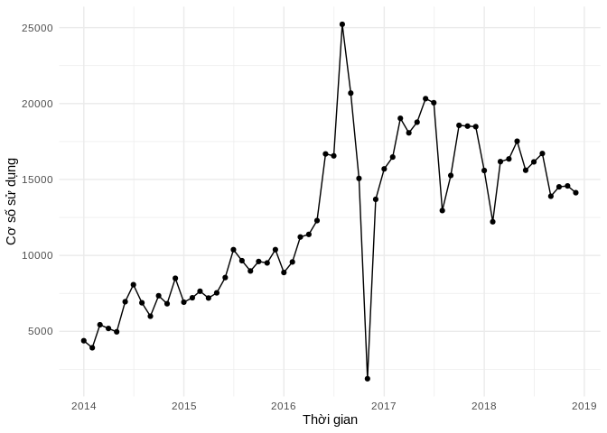
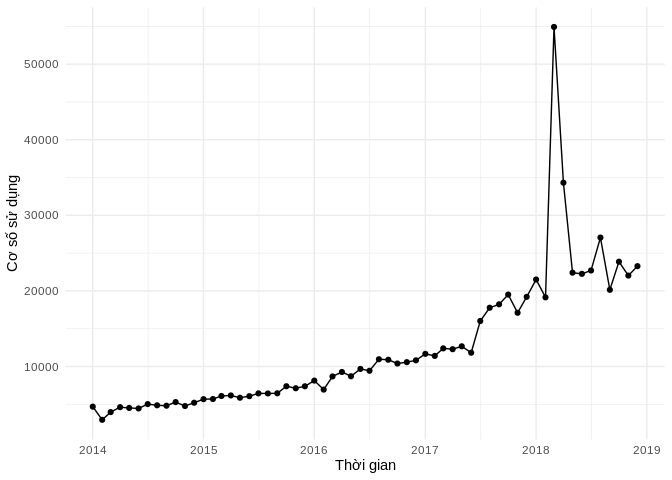

``` r
lay_co_so_thuoc_theo_thoi_gian <- function(hoatchat){
  tonghop %>%
    filter(hoatchat_dvt == !!hoatchat) %>%
    select(c("xuattrongky_sl", "nam", "thang")) %>%
    mutate(date = as.Date(str_c(nam, thang, "01", sep = "-"))) %>%
    group_by(date) %>%
    summarise(coso = sum(xuattrongky_sl)) %>%
    arrange(date)  
}

ve_bieu_do_hc_theo_thoi_gian <- function(data){
data %>%
  ggplot(aes(x=date, y=coso)) +
    geom_line() +
    geom_point() +
    xlab("Thời gian") + 
    scale_x_date(date_breaks = "1 year", labels = date_format("%Y")) +
    ylab("Cơ số sử dụng") + 
    theme_minimal()
}
```

``` r
lay_co_so_thuoc_theo_thoi_gian("deferasirox_250_vien") %>%
  ve_bieu_do_hc_theo_thoi_gian()
```



``` r
lay_co_so_thuoc_theo_thoi_gian("imatinib_100_vien") %>%
  ve_bieu_do_hc_theo_thoi_gian()
```



Nhom AA
-------

``` r
lay_co_so_thuoc_theo_thoi_gian("deferasirox_250_vien")
```

    ## # A tibble: 60 x 2
    ##    date        coso
    ##    <date>     <dbl>
    ##  1 2014-01-01  4383
    ##  2 2014-02-01  3919
    ##  3 2014-03-01  5435
    ##  4 2014-04-01  5190
    ##  5 2014-05-01  4968
    ##  6 2014-06-01  6951
    ##  7 2014-07-01  8073
    ##  8 2014-08-01  6882
    ##  9 2014-09-01  5996
    ## 10 2014-10-01  7344
    ## # ... with 50 more rows

``` r
lay_co_so_thuoc_theo_thoi_gian("imatinib_100_vien")
```

    ## # A tibble: 60 x 2
    ##    date        coso
    ##    <date>     <dbl>
    ##  1 2014-01-01  4693
    ##  2 2014-02-01  2949
    ##  3 2014-03-01  3970
    ##  4 2014-04-01  4624
    ##  5 2014-05-01  4521
    ##  6 2014-06-01  4454
    ##  7 2014-07-01  5029
    ##  8 2014-08-01  4869
    ##  9 2014-09-01  4815
    ## 10 2014-10-01  5296
    ## # ... with 50 more rows
