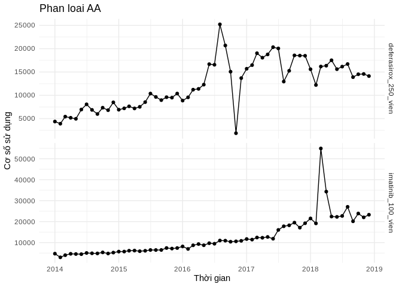
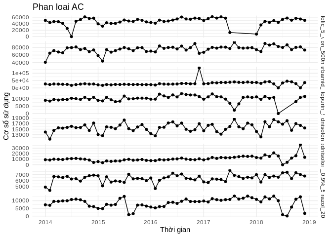
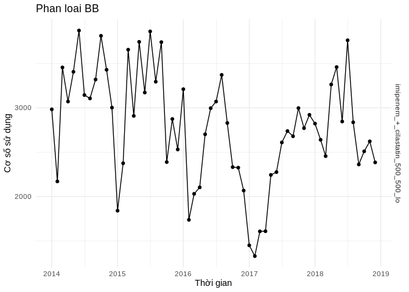
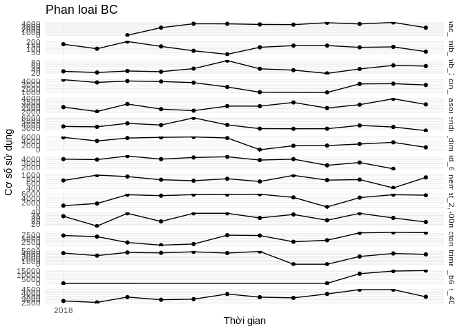

### Bieu do (dua vao bai viet)

``` r
bieudo_coso_phanloai("AA")
```



``` r
bieudo_coso_phanloai("AB")
```


``` r
bieudo_coso_phanloai("AC")
```



``` r
bieudo_coso_phanloai("BB")
```



``` r
bieudo_coso_phanloai("BC")
```



### Bang so lieu thong ke (khong dua vao bai viet)

``` r
knitr::kable(df, format="html", 
             col.names = names(df))
```

<table>
<thead>
<tr>
<th style="text-align:left;">
date
</th>
<th style="text-align:right;">
sulfamethoxazole\_trimethoprim\_960\_vien
</th>
<th style="text-align:right;">
amox\_clavulanac\_500\_125\_vien
</th>
<th style="text-align:right;">
ciprofloxacin\_500\_vien
</th>
<th style="text-align:right;">
imipenem\_+\_cilastatin\_500\_500\_lo
</th>
<th style="text-align:right;">
meropenem\_1g\_lo
</th>
<th style="text-align:right;">
natri\_clorid\_0,9%\_500ml\_chai
</th>
<th style="text-align:right;">
kali\_clorid\_600\_vien
</th>
<th style="text-align:right;">
vitamin\_b1\_b6\_b12\_vien
</th>
<th style="text-align:right;">
vitamin\_e\_400ui\_vien
</th>
<th style="text-align:right;">
spironolacton\_25\_vien
</th>
<th style="text-align:right;">
methylprednisolon\_16\_vien
</th>
<th style="text-align:right;">
methylprednisolon\_4\_vien
</th>
<th style="text-align:right;">
dexamethason\_4mg\_lo
</th>
<th style="text-align:right;">
deferipron\_500mg\_vien
</th>
<th style="text-align:right;">
acidfolic\_5\_vien
</th>
<th style="text-align:right;">
deferasirox\_250\_vien
</th>
<th style="text-align:right;">
omeprazol\_20\_vien
</th>
<th style="text-align:right;">
guaiazulen\_dimethicon\_goi
</th>
<th style="text-align:right;">
diosmine\_hesperidin\_450\_50\_vien
</th>
<th style="text-align:right;">
hydroxycarbamid\_500\_vien
</th>
<th style="text-align:right;">
imatinib\_100\_vien
</th>
<th style="text-align:right;">
mercaptopurin\_50\_vien
</th>
<th style="text-align:right;">
nilotinib\_200\_vien
</th>
<th style="text-align:right;">
methotrexat\_2,5mg\_vien
</th>
<th style="text-align:right;">
bortezomib\_1mg\_lo
</th>
<th style="text-align:right;">
bortezomib\_3,5mg\_lo
</th>
<th style="text-align:right;">
rituximab\_500mg\_50ml\_lo
</th>
</tr>
</thead>
<tbody>
<tr>
<td style="text-align:left;">
2014-01-01
</td>
<td style="text-align:right;">
1246
</td>
<td style="text-align:right;">
315
</td>
<td style="text-align:right;">
2291
</td>
<td style="text-align:right;">
2983
</td>
<td style="text-align:right;">
369
</td>
<td style="text-align:right;">
4960
</td>
<td style="text-align:right;">
2155
</td>
<td style="text-align:right;">
3709
</td>
<td style="text-align:right;">
993.0
</td>
<td style="text-align:right;">
4291
</td>
<td style="text-align:right;">
13949.0
</td>
<td style="text-align:right;">
9154
</td>
<td style="text-align:right;">
2102.00
</td>
<td style="text-align:right;">
40795
</td>
<td style="text-align:right;">
50174
</td>
<td style="text-align:right;">
4383
</td>
<td style="text-align:right;">
7345
</td>
<td style="text-align:right;">
NA
</td>
<td style="text-align:right;">
8573
</td>
<td style="text-align:right;">
26811
</td>
<td style="text-align:right;">
4693
</td>
<td style="text-align:right;">
9029
</td>
<td style="text-align:right;">
NA
</td>
<td style="text-align:right;">
NA
</td>
<td style="text-align:right;">
NA
</td>
<td style="text-align:right;">
62
</td>
<td style="text-align:right;">
13
</td>
</tr>
<tr>
<td style="text-align:left;">
2014-02-01
</td>
<td style="text-align:right;">
673
</td>
<td style="text-align:right;">
964
</td>
<td style="text-align:right;">
1853
</td>
<td style="text-align:right;">
2171
</td>
<td style="text-align:right;">
107
</td>
<td style="text-align:right;">
4430
</td>
<td style="text-align:right;">
1690
</td>
<td style="text-align:right;">
2220
</td>
<td style="text-align:right;">
106.0
</td>
<td style="text-align:right;">
5260
</td>
<td style="text-align:right;">
11392.0
</td>
<td style="text-align:right;">
8595
</td>
<td style="text-align:right;">
1908.00
</td>
<td style="text-align:right;">
65010
</td>
<td style="text-align:right;">
43441
</td>
<td style="text-align:right;">
3919
</td>
<td style="text-align:right;">
7026
</td>
<td style="text-align:right;">
NA
</td>
<td style="text-align:right;">
6060
</td>
<td style="text-align:right;">
23228
</td>
<td style="text-align:right;">
2949
</td>
<td style="text-align:right;">
8514
</td>
<td style="text-align:right;">
NA
</td>
<td style="text-align:right;">
NA
</td>
<td style="text-align:right;">
NA
</td>
<td style="text-align:right;">
54
</td>
<td style="text-align:right;">
13
</td>
</tr>
<tr>
<td style="text-align:left;">
2014-03-01
</td>
<td style="text-align:right;">
2067
</td>
<td style="text-align:right;">
1650
</td>
<td style="text-align:right;">
2727
</td>
<td style="text-align:right;">
3455
</td>
<td style="text-align:right;">
586
</td>
<td style="text-align:right;">
6679
</td>
<td style="text-align:right;">
2028
</td>
<td style="text-align:right;">
4108
</td>
<td style="text-align:right;">
963.0
</td>
<td style="text-align:right;">
4354
</td>
<td style="text-align:right;">
14535.0
</td>
<td style="text-align:right;">
10101
</td>
<td style="text-align:right;">
2514.00
</td>
<td style="text-align:right;">
71916
</td>
<td style="text-align:right;">
46361
</td>
<td style="text-align:right;">
5435
</td>
<td style="text-align:right;">
9568
</td>
<td style="text-align:right;">
NA
</td>
<td style="text-align:right;">
7499
</td>
<td style="text-align:right;">
26560
</td>
<td style="text-align:right;">
3970
</td>
<td style="text-align:right;">
9591
</td>
<td style="text-align:right;">
NA
</td>
<td style="text-align:right;">
2145
</td>
<td style="text-align:right;">
NA
</td>
<td style="text-align:right;">
57
</td>
<td style="text-align:right;">
15
</td>
</tr>
<tr>
<td style="text-align:left;">
2014-04-01
</td>
<td style="text-align:right;">
2344
</td>
<td style="text-align:right;">
1911
</td>
<td style="text-align:right;">
2794
</td>
<td style="text-align:right;">
3071
</td>
<td style="text-align:right;">
603
</td>
<td style="text-align:right;">
6624
</td>
<td style="text-align:right;">
2538
</td>
<td style="text-align:right;">
9122
</td>
<td style="text-align:right;">
1666.0
</td>
<td style="text-align:right;">
4730
</td>
<td style="text-align:right;">
15479.0
</td>
<td style="text-align:right;">
9821
</td>
<td style="text-align:right;">
1823.00
</td>
<td style="text-align:right;">
68129
</td>
<td style="text-align:right;">
46059
</td>
<td style="text-align:right;">
5190
</td>
<td style="text-align:right;">
9594
</td>
<td style="text-align:right;">
NA
</td>
<td style="text-align:right;">
6533
</td>
<td style="text-align:right;">
25612
</td>
<td style="text-align:right;">
4624
</td>
<td style="text-align:right;">
9234
</td>
<td style="text-align:right;">
NA
</td>
<td style="text-align:right;">
4687
</td>
<td style="text-align:right;">
NA
</td>
<td style="text-align:right;">
47
</td>
<td style="text-align:right;">
15
</td>
</tr>
<tr>
<td style="text-align:left;">
2014-05-01
</td>
<td style="text-align:right;">
2689
</td>
<td style="text-align:right;">
1666
</td>
<td style="text-align:right;">
2478
</td>
<td style="text-align:right;">
3406
</td>
<td style="text-align:right;">
514
</td>
<td style="text-align:right;">
6520
</td>
<td style="text-align:right;">
2136
</td>
<td style="text-align:right;">
7702
</td>
<td style="text-align:right;">
1499.0
</td>
<td style="text-align:right;">
4869
</td>
<td style="text-align:right;">
15363.0
</td>
<td style="text-align:right;">
9480
</td>
<td style="text-align:right;">
2182.00
</td>
<td style="text-align:right;">
66103
</td>
<td style="text-align:right;">
41012
</td>
<td style="text-align:right;">
4968
</td>
<td style="text-align:right;">
9871
</td>
<td style="text-align:right;">
NA
</td>
<td style="text-align:right;">
5702
</td>
<td style="text-align:right;">
24600
</td>
<td style="text-align:right;">
4521
</td>
<td style="text-align:right;">
9532
</td>
<td style="text-align:right;">
NA
</td>
<td style="text-align:right;">
4955
</td>
<td style="text-align:right;">
NA
</td>
<td style="text-align:right;">
51
</td>
<td style="text-align:right;">
10
</td>
</tr>
<tr>
<td style="text-align:left;">
2014-06-01
</td>
<td style="text-align:right;">
1835
</td>
<td style="text-align:right;">
2297
</td>
<td style="text-align:right;">
2707
</td>
<td style="text-align:right;">
3871
</td>
<td style="text-align:right;">
658
</td>
<td style="text-align:right;">
6717
</td>
<td style="text-align:right;">
2528
</td>
<td style="text-align:right;">
305
</td>
<td style="text-align:right;">
1285.0
</td>
<td style="text-align:right;">
5040
</td>
<td style="text-align:right;">
15640.0
</td>
<td style="text-align:right;">
10747
</td>
<td style="text-align:right;">
2113.00
</td>
<td style="text-align:right;">
79162
</td>
<td style="text-align:right;">
25380
</td>
<td style="text-align:right;">
6951
</td>
<td style="text-align:right;">
9974
</td>
<td style="text-align:right;">
NA
</td>
<td style="text-align:right;">
1184
</td>
<td style="text-align:right;">
23925
</td>
<td style="text-align:right;">
4454
</td>
<td style="text-align:right;">
9616
</td>
<td style="text-align:right;">
NA
</td>
<td style="text-align:right;">
1731
</td>
<td style="text-align:right;">
NA
</td>
<td style="text-align:right;">
44
</td>
<td style="text-align:right;">
11
</td>
</tr>
<tr>
<td style="text-align:left;">
2014-07-01
</td>
<td style="text-align:right;">
819
</td>
<td style="text-align:right;">
2641
</td>
<td style="text-align:right;">
3249
</td>
<td style="text-align:right;">
3144
</td>
<td style="text-align:right;">
801
</td>
<td style="text-align:right;">
6279
</td>
<td style="text-align:right;">
3169
</td>
<td style="text-align:right;">
184
</td>
<td style="text-align:right;">
506.0
</td>
<td style="text-align:right;">
5618
</td>
<td style="text-align:right;">
16020.0
</td>
<td style="text-align:right;">
11154
</td>
<td style="text-align:right;">
2358.00
</td>
<td style="text-align:right;">
79859
</td>
<td style="text-align:right;">
0
</td>
<td style="text-align:right;">
8073
</td>
<td style="text-align:right;">
10772
</td>
<td style="text-align:right;">
NA
</td>
<td style="text-align:right;">
357
</td>
<td style="text-align:right;">
17433
</td>
<td style="text-align:right;">
5029
</td>
<td style="text-align:right;">
10455
</td>
<td style="text-align:right;">
NA
</td>
<td style="text-align:right;">
47
</td>
<td style="text-align:right;">
NA
</td>
<td style="text-align:right;">
39
</td>
<td style="text-align:right;">
17
</td>
</tr>
<tr>
<td style="text-align:left;">
2014-08-01
</td>
<td style="text-align:right;">
1992
</td>
<td style="text-align:right;">
2319
</td>
<td style="text-align:right;">
2754
</td>
<td style="text-align:right;">
3106
</td>
<td style="text-align:right;">
976
</td>
<td style="text-align:right;">
6319
</td>
<td style="text-align:right;">
3033
</td>
<td style="text-align:right;">
12537
</td>
<td style="text-align:right;">
1446.0
</td>
<td style="text-align:right;">
5750
</td>
<td style="text-align:right;">
15557.0
</td>
<td style="text-align:right;">
11462
</td>
<td style="text-align:right;">
2158.00
</td>
<td style="text-align:right;">
81597
</td>
<td style="text-align:right;">
47586
</td>
<td style="text-align:right;">
6882
</td>
<td style="text-align:right;">
11029
</td>
<td style="text-align:right;">
NA
</td>
<td style="text-align:right;">
5441
</td>
<td style="text-align:right;">
22491
</td>
<td style="text-align:right;">
4869
</td>
<td style="text-align:right;">
10130
</td>
<td style="text-align:right;">
NA
</td>
<td style="text-align:right;">
1112
</td>
<td style="text-align:right;">
NA
</td>
<td style="text-align:right;">
54
</td>
<td style="text-align:right;">
12
</td>
</tr>
<tr>
<td style="text-align:left;">
2014-09-01
</td>
<td style="text-align:right;">
2315
</td>
<td style="text-align:right;">
2559
</td>
<td style="text-align:right;">
2478
</td>
<td style="text-align:right;">
3319
</td>
<td style="text-align:right;">
707
</td>
<td style="text-align:right;">
5941
</td>
<td style="text-align:right;">
2980
</td>
<td style="text-align:right;">
15789
</td>
<td style="text-align:right;">
1935.0
</td>
<td style="text-align:right;">
4971
</td>
<td style="text-align:right;">
15595.0
</td>
<td style="text-align:right;">
10608
</td>
<td style="text-align:right;">
2889.00
</td>
<td style="text-align:right;">
74626
</td>
<td style="text-align:right;">
52479
</td>
<td style="text-align:right;">
5996
</td>
<td style="text-align:right;">
10597
</td>
<td style="text-align:right;">
NA
</td>
<td style="text-align:right;">
6791
</td>
<td style="text-align:right;">
25686
</td>
<td style="text-align:right;">
4815
</td>
<td style="text-align:right;">
9688
</td>
<td style="text-align:right;">
NA
</td>
<td style="text-align:right;">
5013
</td>
<td style="text-align:right;">
NA
</td>
<td style="text-align:right;">
66
</td>
<td style="text-align:right;">
13
</td>
</tr>
<tr>
<td style="text-align:left;">
2014-10-01
</td>
<td style="text-align:right;">
2986
</td>
<td style="text-align:right;">
2821
</td>
<td style="text-align:right;">
2980
</td>
<td style="text-align:right;">
3811
</td>
<td style="text-align:right;">
823
</td>
<td style="text-align:right;">
6558
</td>
<td style="text-align:right;">
2806
</td>
<td style="text-align:right;">
16965
</td>
<td style="text-align:right;">
1958.0
</td>
<td style="text-align:right;">
5058
</td>
<td style="text-align:right;">
16549.0
</td>
<td style="text-align:right;">
10019
</td>
<td style="text-align:right;">
3512.00
</td>
<td style="text-align:right;">
77532
</td>
<td style="text-align:right;">
60967
</td>
<td style="text-align:right;">
7344
</td>
<td style="text-align:right;">
9576
</td>
<td style="text-align:right;">
NA
</td>
<td style="text-align:right;">
6368
</td>
<td style="text-align:right;">
28326
</td>
<td style="text-align:right;">
5296
</td>
<td style="text-align:right;">
11095
</td>
<td style="text-align:right;">
NA
</td>
<td style="text-align:right;">
5736
</td>
<td style="text-align:right;">
NA
</td>
<td style="text-align:right;">
91
</td>
<td style="text-align:right;">
13
</td>
</tr>
<tr>
<td style="text-align:left;">
2014-11-01
</td>
<td style="text-align:right;">
2806
</td>
<td style="text-align:right;">
2572
</td>
<td style="text-align:right;">
3248
</td>
<td style="text-align:right;">
3429
</td>
<td style="text-align:right;">
570
</td>
<td style="text-align:right;">
6811
</td>
<td style="text-align:right;">
3717
</td>
<td style="text-align:right;">
14600
</td>
<td style="text-align:right;">
1668.3
</td>
<td style="text-align:right;">
5442
</td>
<td style="text-align:right;">
14533.0
</td>
<td style="text-align:right;">
8525
</td>
<td style="text-align:right;">
2703.00
</td>
<td style="text-align:right;">
69087
</td>
<td style="text-align:right;">
56144
</td>
<td style="text-align:right;">
6818
</td>
<td style="text-align:right;">
6429
</td>
<td style="text-align:right;">
NA
</td>
<td style="text-align:right;">
6722
</td>
<td style="text-align:right;">
25632
</td>
<td style="text-align:right;">
4774
</td>
<td style="text-align:right;">
9689
</td>
<td style="text-align:right;">
NA
</td>
<td style="text-align:right;">
4721
</td>
<td style="text-align:right;">
NA
</td>
<td style="text-align:right;">
60
</td>
<td style="text-align:right;">
9
</td>
</tr>
<tr>
<td style="text-align:left;">
2014-12-01
</td>
<td style="text-align:right;">
3102
</td>
<td style="text-align:right;">
201
</td>
<td style="text-align:right;">
3649
</td>
<td style="text-align:right;">
3002
</td>
<td style="text-align:right;">
1114
</td>
<td style="text-align:right;">
6904
</td>
<td style="text-align:right;">
3559
</td>
<td style="text-align:right;">
15468
</td>
<td style="text-align:right;">
2040.0
</td>
<td style="text-align:right;">
5678
</td>
<td style="text-align:right;">
17212.0
</td>
<td style="text-align:right;">
4225
</td>
<td style="text-align:right;">
3118.00
</td>
<td style="text-align:right;">
73603
</td>
<td style="text-align:right;">
57073
</td>
<td style="text-align:right;">
8496
</td>
<td style="text-align:right;">
6185
</td>
<td style="text-align:right;">
NA
</td>
<td style="text-align:right;">
7061
</td>
<td style="text-align:right;">
26371
</td>
<td style="text-align:right;">
5212
</td>
<td style="text-align:right;">
11076
</td>
<td style="text-align:right;">
NA
</td>
<td style="text-align:right;">
5823
</td>
<td style="text-align:right;">
NA
</td>
<td style="text-align:right;">
76
</td>
<td style="text-align:right;">
8
</td>
</tr>
<tr>
<td style="text-align:left;">
2015-01-01
</td>
<td style="text-align:right;">
3094
</td>
<td style="text-align:right;">
60
</td>
<td style="text-align:right;">
3000
</td>
<td style="text-align:right;">
1841
</td>
<td style="text-align:right;">
1186
</td>
<td style="text-align:right;">
6800
</td>
<td style="text-align:right;">
3552
</td>
<td style="text-align:right;">
10466
</td>
<td style="text-align:right;">
1639.0
</td>
<td style="text-align:right;">
3951
</td>
<td style="text-align:right;">
13045.0
</td>
<td style="text-align:right;">
5760
</td>
<td style="text-align:right;">
3379.00
</td>
<td style="text-align:right;">
58458
</td>
<td style="text-align:right;">
39492
</td>
<td style="text-align:right;">
6922
</td>
<td style="text-align:right;">
5011
</td>
<td style="text-align:right;">
NA
</td>
<td style="text-align:right;">
4560
</td>
<td style="text-align:right;">
20672
</td>
<td style="text-align:right;">
5683
</td>
<td style="text-align:right;">
8972
</td>
<td style="text-align:right;">
NA
</td>
<td style="text-align:right;">
4529
</td>
<td style="text-align:right;">
NA
</td>
<td style="text-align:right;">
90
</td>
<td style="text-align:right;">
17
</td>
</tr>
<tr>
<td style="text-align:left;">
2015-02-01
</td>
<td style="text-align:right;">
2735
</td>
<td style="text-align:right;">
903
</td>
<td style="text-align:right;">
2498
</td>
<td style="text-align:right;">
2376
</td>
<td style="text-align:right;">
1007
</td>
<td style="text-align:right;">
5167
</td>
<td style="text-align:right;">
2710
</td>
<td style="text-align:right;">
8947
</td>
<td style="text-align:right;">
1313.0
</td>
<td style="text-align:right;">
3187
</td>
<td style="text-align:right;">
12662.0
</td>
<td style="text-align:right;">
3815
</td>
<td style="text-align:right;">
2528.00
</td>
<td style="text-align:right;">
43842
</td>
<td style="text-align:right;">
32334
</td>
<td style="text-align:right;">
7211
</td>
<td style="text-align:right;">
4862
</td>
<td style="text-align:right;">
NA
</td>
<td style="text-align:right;">
2994
</td>
<td style="text-align:right;">
17293
</td>
<td style="text-align:right;">
5700
</td>
<td style="text-align:right;">
8621
</td>
<td style="text-align:right;">
NA
</td>
<td style="text-align:right;">
4437
</td>
<td style="text-align:right;">
NA
</td>
<td style="text-align:right;">
61
</td>
<td style="text-align:right;">
15
</td>
</tr>
<tr>
<td style="text-align:left;">
2015-03-01
</td>
<td style="text-align:right;">
3533
</td>
<td style="text-align:right;">
1675
</td>
<td style="text-align:right;">
2787
</td>
<td style="text-align:right;">
3655
</td>
<td style="text-align:right;">
706
</td>
<td style="text-align:right;">
6632
</td>
<td style="text-align:right;">
2884
</td>
<td style="text-align:right;">
12563
</td>
<td style="text-align:right;">
1808.0
</td>
<td style="text-align:right;">
4536
</td>
<td style="text-align:right;">
15824.0
</td>
<td style="text-align:right;">
6892
</td>
<td style="text-align:right;">
3570.00
</td>
<td style="text-align:right;">
74428
</td>
<td style="text-align:right;">
42799
</td>
<td style="text-align:right;">
7642
</td>
<td style="text-align:right;">
7649
</td>
<td style="text-align:right;">
NA
</td>
<td style="text-align:right;">
5859
</td>
<td style="text-align:right;">
22678
</td>
<td style="text-align:right;">
6100
</td>
<td style="text-align:right;">
11095
</td>
<td style="text-align:right;">
60
</td>
<td style="text-align:right;">
5806
</td>
<td style="text-align:right;">
NA
</td>
<td style="text-align:right;">
92
</td>
<td style="text-align:right;">
16
</td>
</tr>
<tr>
<td style="text-align:left;">
2015-04-01
</td>
<td style="text-align:right;">
3215
</td>
<td style="text-align:right;">
1784
</td>
<td style="text-align:right;">
2598
</td>
<td style="text-align:right;">
2909
</td>
<td style="text-align:right;">
552
</td>
<td style="text-align:right;">
5778
</td>
<td style="text-align:right;">
2904
</td>
<td style="text-align:right;">
11794
</td>
<td style="text-align:right;">
1832.0
</td>
<td style="text-align:right;">
3643
</td>
<td style="text-align:right;">
15669.0
</td>
<td style="text-align:right;">
6146
</td>
<td style="text-align:right;">
2842.00
</td>
<td style="text-align:right;">
67713
</td>
<td style="text-align:right;">
40936
</td>
<td style="text-align:right;">
7195
</td>
<td style="text-align:right;">
7100
</td>
<td style="text-align:right;">
NA
</td>
<td style="text-align:right;">
5614
</td>
<td style="text-align:right;">
20451
</td>
<td style="text-align:right;">
6172
</td>
<td style="text-align:right;">
9389
</td>
<td style="text-align:right;">
495
</td>
<td style="text-align:right;">
4842
</td>
<td style="text-align:right;">
NA
</td>
<td style="text-align:right;">
77
</td>
<td style="text-align:right;">
18
</td>
</tr>
<tr>
<td style="text-align:left;">
2015-05-01
</td>
<td style="text-align:right;">
3228
</td>
<td style="text-align:right;">
1871
</td>
<td style="text-align:right;">
2850
</td>
<td style="text-align:right;">
3743
</td>
<td style="text-align:right;">
455
</td>
<td style="text-align:right;">
5963
</td>
<td style="text-align:right;">
3072
</td>
<td style="text-align:right;">
10379
</td>
<td style="text-align:right;">
1552.0
</td>
<td style="text-align:right;">
4184
</td>
<td style="text-align:right;">
15174.0
</td>
<td style="text-align:right;">
6831
</td>
<td style="text-align:right;">
2851.00
</td>
<td style="text-align:right;">
71870
</td>
<td style="text-align:right;">
40890
</td>
<td style="text-align:right;">
7535
</td>
<td style="text-align:right;">
7563
</td>
<td style="text-align:right;">
NA
</td>
<td style="text-align:right;">
5894
</td>
<td style="text-align:right;">
23636
</td>
<td style="text-align:right;">
5872
</td>
<td style="text-align:right;">
8107
</td>
<td style="text-align:right;">
704
</td>
<td style="text-align:right;">
5172
</td>
<td style="text-align:right;">
NA
</td>
<td style="text-align:right;">
69
</td>
<td style="text-align:right;">
22
</td>
</tr>
<tr>
<td style="text-align:left;">
2015-06-01
</td>
<td style="text-align:right;">
3214
</td>
<td style="text-align:right;">
2135
</td>
<td style="text-align:right;">
2749
</td>
<td style="text-align:right;">
3172
</td>
<td style="text-align:right;">
504
</td>
<td style="text-align:right;">
5887
</td>
<td style="text-align:right;">
3226
</td>
<td style="text-align:right;">
12282
</td>
<td style="text-align:right;">
1989.0
</td>
<td style="text-align:right;">
5095
</td>
<td style="text-align:right;">
16491.0
</td>
<td style="text-align:right;">
6768
</td>
<td style="text-align:right;">
2617.00
</td>
<td style="text-align:right;">
76003
</td>
<td style="text-align:right;">
45059
</td>
<td style="text-align:right;">
8542
</td>
<td style="text-align:right;">
11542
</td>
<td style="text-align:right;">
NA
</td>
<td style="text-align:right;">
5864
</td>
<td style="text-align:right;">
23282
</td>
<td style="text-align:right;">
6076
</td>
<td style="text-align:right;">
8470
</td>
<td style="text-align:right;">
1368
</td>
<td style="text-align:right;">
5885
</td>
<td style="text-align:right;">
NA
</td>
<td style="text-align:right;">
81
</td>
<td style="text-align:right;">
15
</td>
</tr>
<tr>
<td style="text-align:left;">
2015-07-01
</td>
<td style="text-align:right;">
24
</td>
<td style="text-align:right;">
2250
</td>
<td style="text-align:right;">
2848
</td>
<td style="text-align:right;">
3861
</td>
<td style="text-align:right;">
499
</td>
<td style="text-align:right;">
5732
</td>
<td style="text-align:right;">
2625
</td>
<td style="text-align:right;">
13837
</td>
<td style="text-align:right;">
2520.0
</td>
<td style="text-align:right;">
5632
</td>
<td style="text-align:right;">
18283.0
</td>
<td style="text-align:right;">
8888
</td>
<td style="text-align:right;">
2520.00
</td>
<td style="text-align:right;">
80149
</td>
<td style="text-align:right;">
51293
</td>
<td style="text-align:right;">
10379
</td>
<td style="text-align:right;">
12789
</td>
<td style="text-align:right;">
NA
</td>
<td style="text-align:right;">
7338
</td>
<td style="text-align:right;">
24728
</td>
<td style="text-align:right;">
6448
</td>
<td style="text-align:right;">
11956
</td>
<td style="text-align:right;">
1434
</td>
<td style="text-align:right;">
5621
</td>
<td style="text-align:right;">
NA
</td>
<td style="text-align:right;">
87
</td>
<td style="text-align:right;">
13
</td>
</tr>
<tr>
<td style="text-align:left;">
2015-08-01
</td>
<td style="text-align:right;">
1176
</td>
<td style="text-align:right;">
1878
</td>
<td style="text-align:right;">
2872
</td>
<td style="text-align:right;">
3294
</td>
<td style="text-align:right;">
999
</td>
<td style="text-align:right;">
7051
</td>
<td style="text-align:right;">
3631
</td>
<td style="text-align:right;">
12764
</td>
<td style="text-align:right;">
2357.0
</td>
<td style="text-align:right;">
4735
</td>
<td style="text-align:right;">
15187.0
</td>
<td style="text-align:right;">
9846
</td>
<td style="text-align:right;">
2419.00
</td>
<td style="text-align:right;">
76765
</td>
<td style="text-align:right;">
48235
</td>
<td style="text-align:right;">
9654
</td>
<td style="text-align:right;">
955
</td>
<td style="text-align:right;">
0
</td>
<td style="text-align:right;">
1186
</td>
<td style="text-align:right;">
23804
</td>
<td style="text-align:right;">
6436
</td>
<td style="text-align:right;">
10000
</td>
<td style="text-align:right;">
1214
</td>
<td style="text-align:right;">
4982
</td>
<td style="text-align:right;">
NA
</td>
<td style="text-align:right;">
75
</td>
<td style="text-align:right;">
9
</td>
</tr>
<tr>
<td style="text-align:left;">
2015-09-01
</td>
<td style="text-align:right;">
3132
</td>
<td style="text-align:right;">
1946
</td>
<td style="text-align:right;">
3076
</td>
<td style="text-align:right;">
3740
</td>
<td style="text-align:right;">
893
</td>
<td style="text-align:right;">
6299
</td>
<td style="text-align:right;">
2933
</td>
<td style="text-align:right;">
13284
</td>
<td style="text-align:right;">
2699.0
</td>
<td style="text-align:right;">
4407
</td>
<td style="text-align:right;">
14455.0
</td>
<td style="text-align:right;">
8195
</td>
<td style="text-align:right;">
2442.00
</td>
<td style="text-align:right;">
71769
</td>
<td style="text-align:right;">
47100
</td>
<td style="text-align:right;">
8974
</td>
<td style="text-align:right;">
1589
</td>
<td style="text-align:right;">
656
</td>
<td style="text-align:right;">
1744
</td>
<td style="text-align:right;">
23004
</td>
<td style="text-align:right;">
6457
</td>
<td style="text-align:right;">
10080
</td>
<td style="text-align:right;">
1294
</td>
<td style="text-align:right;">
4964
</td>
<td style="text-align:right;">
NA
</td>
<td style="text-align:right;">
61
</td>
<td style="text-align:right;">
11
</td>
</tr>
<tr>
<td style="text-align:left;">
2015-10-01
</td>
<td style="text-align:right;">
3385
</td>
<td style="text-align:right;">
2464
</td>
<td style="text-align:right;">
3379
</td>
<td style="text-align:right;">
2389
</td>
<td style="text-align:right;">
704
</td>
<td style="text-align:right;">
6373
</td>
<td style="text-align:right;">
2905
</td>
<td style="text-align:right;">
14829
</td>
<td style="text-align:right;">
3600.7
</td>
<td style="text-align:right;">
5046
</td>
<td style="text-align:right;">
15781.0
</td>
<td style="text-align:right;">
8692
</td>
<td style="text-align:right;">
2566.00
</td>
<td style="text-align:right;">
79391
</td>
<td style="text-align:right;">
53063
</td>
<td style="text-align:right;">
9600
</td>
<td style="text-align:right;">
7132
</td>
<td style="text-align:right;">
1939
</td>
<td style="text-align:right;">
5695
</td>
<td style="text-align:right;">
23417
</td>
<td style="text-align:right;">
7392
</td>
<td style="text-align:right;">
10530
</td>
<td style="text-align:right;">
1561
</td>
<td style="text-align:right;">
5279
</td>
<td style="text-align:right;">
NA
</td>
<td style="text-align:right;">
80
</td>
<td style="text-align:right;">
10
</td>
</tr>
<tr>
<td style="text-align:left;">
2015-11-01
</td>
<td style="text-align:right;">
3117
</td>
<td style="text-align:right;">
2597
</td>
<td style="text-align:right;">
3460
</td>
<td style="text-align:right;">
2874
</td>
<td style="text-align:right;">
693
</td>
<td style="text-align:right;">
6323
</td>
<td style="text-align:right;">
3064
</td>
<td style="text-align:right;">
14237
</td>
<td style="text-align:right;">
4412.0
</td>
<td style="text-align:right;">
4971
</td>
<td style="text-align:right;">
16687.0
</td>
<td style="text-align:right;">
9566
</td>
<td style="text-align:right;">
2438.00
</td>
<td style="text-align:right;">
79814
</td>
<td style="text-align:right;">
50547
</td>
<td style="text-align:right;">
9505
</td>
<td style="text-align:right;">
7271
</td>
<td style="text-align:right;">
2603
</td>
<td style="text-align:right;">
5392
</td>
<td style="text-align:right;">
22163
</td>
<td style="text-align:right;">
7127
</td>
<td style="text-align:right;">
10547
</td>
<td style="text-align:right;">
1902
</td>
<td style="text-align:right;">
4787
</td>
<td style="text-align:right;">
NA
</td>
<td style="text-align:right;">
65
</td>
<td style="text-align:right;">
18
</td>
</tr>
<tr>
<td style="text-align:left;">
2015-12-01
</td>
<td style="text-align:right;">
3077
</td>
<td style="text-align:right;">
3551
</td>
<td style="text-align:right;">
3382
</td>
<td style="text-align:right;">
2531
</td>
<td style="text-align:right;">
948
</td>
<td style="text-align:right;">
6014
</td>
<td style="text-align:right;">
3359
</td>
<td style="text-align:right;">
14064
</td>
<td style="text-align:right;">
4132.0
</td>
<td style="text-align:right;">
4601
</td>
<td style="text-align:right;">
14932.0
</td>
<td style="text-align:right;">
7919
</td>
<td style="text-align:right;">
2015.00
</td>
<td style="text-align:right;">
69571
</td>
<td style="text-align:right;">
45496
</td>
<td style="text-align:right;">
10382
</td>
<td style="text-align:right;">
6483
</td>
<td style="text-align:right;">
2582
</td>
<td style="text-align:right;">
5883
</td>
<td style="text-align:right;">
22378
</td>
<td style="text-align:right;">
7385
</td>
<td style="text-align:right;">
10494
</td>
<td style="text-align:right;">
2126
</td>
<td style="text-align:right;">
4101
</td>
<td style="text-align:right;">
NA
</td>
<td style="text-align:right;">
59
</td>
<td style="text-align:right;">
15
</td>
</tr>
<tr>
<td style="text-align:left;">
2016-01-01
</td>
<td style="text-align:right;">
2825
</td>
<td style="text-align:right;">
3029
</td>
<td style="text-align:right;">
2911
</td>
<td style="text-align:right;">
3210
</td>
<td style="text-align:right;">
1031
</td>
<td style="text-align:right;">
6445
</td>
<td style="text-align:right;">
3276
</td>
<td style="text-align:right;">
13399
</td>
<td style="text-align:right;">
3716.0
</td>
<td style="text-align:right;">
3957
</td>
<td style="text-align:right;">
13356.0
</td>
<td style="text-align:right;">
7453
</td>
<td style="text-align:right;">
1880.00
</td>
<td style="text-align:right;">
70541
</td>
<td style="text-align:right;">
43451
</td>
<td style="text-align:right;">
8875
</td>
<td style="text-align:right;">
5890
</td>
<td style="text-align:right;">
3206
</td>
<td style="text-align:right;">
4775
</td>
<td style="text-align:right;">
22109
</td>
<td style="text-align:right;">
8139
</td>
<td style="text-align:right;">
9827
</td>
<td style="text-align:right;">
2624
</td>
<td style="text-align:right;">
3947
</td>
<td style="text-align:right;">
NA
</td>
<td style="text-align:right;">
46
</td>
<td style="text-align:right;">
17
</td>
</tr>
<tr>
<td style="text-align:left;">
2016-02-01
</td>
<td style="text-align:right;">
2542
</td>
<td style="text-align:right;">
3416
</td>
<td style="text-align:right;">
3560
</td>
<td style="text-align:right;">
1738
</td>
<td style="text-align:right;">
472
</td>
<td style="text-align:right;">
4739
</td>
<td style="text-align:right;">
2238
</td>
<td style="text-align:right;">
10973
</td>
<td style="text-align:right;">
3835.0
</td>
<td style="text-align:right;">
4079
</td>
<td style="text-align:right;">
12592.0
</td>
<td style="text-align:right;">
7463
</td>
<td style="text-align:right;">
1895.00
</td>
<td style="text-align:right;">
68307
</td>
<td style="text-align:right;">
41485
</td>
<td style="text-align:right;">
9568
</td>
<td style="text-align:right;">
5353
</td>
<td style="text-align:right;">
2641
</td>
<td style="text-align:right;">
4882
</td>
<td style="text-align:right;">
19588
</td>
<td style="text-align:right;">
6948
</td>
<td style="text-align:right;">
9840
</td>
<td style="text-align:right;">
2029
</td>
<td style="text-align:right;">
3916
</td>
<td style="text-align:right;">
NA
</td>
<td style="text-align:right;">
60
</td>
<td style="text-align:right;">
18
</td>
</tr>
<tr>
<td style="text-align:left;">
2016-03-01
</td>
<td style="text-align:right;">
3264
</td>
<td style="text-align:right;">
3322
</td>
<td style="text-align:right;">
3390
</td>
<td style="text-align:right;">
2031
</td>
<td style="text-align:right;">
866
</td>
<td style="text-align:right;">
6080
</td>
<td style="text-align:right;">
2598
</td>
<td style="text-align:right;">
16562
</td>
<td style="text-align:right;">
4719.0
</td>
<td style="text-align:right;">
4487
</td>
<td style="text-align:right;">
15620.0
</td>
<td style="text-align:right;">
9291
</td>
<td style="text-align:right;">
1819.00
</td>
<td style="text-align:right;">
84206
</td>
<td style="text-align:right;">
50930
</td>
<td style="text-align:right;">
11213
</td>
<td style="text-align:right;">
6172
</td>
<td style="text-align:right;">
3284
</td>
<td style="text-align:right;">
6768
</td>
<td style="text-align:right;">
28700
</td>
<td style="text-align:right;">
8690
</td>
<td style="text-align:right;">
13281
</td>
<td style="text-align:right;">
2965
</td>
<td style="text-align:right;">
5924
</td>
<td style="text-align:right;">
NA
</td>
<td style="text-align:right;">
59
</td>
<td style="text-align:right;">
18
</td>
</tr>
<tr>
<td style="text-align:left;">
2016-04-01
</td>
<td style="text-align:right;">
3375
</td>
<td style="text-align:right;">
4065
</td>
<td style="text-align:right;">
3878
</td>
<td style="text-align:right;">
2104
</td>
<td style="text-align:right;">
903
</td>
<td style="text-align:right;">
6456
</td>
<td style="text-align:right;">
2831
</td>
<td style="text-align:right;">
14542
</td>
<td style="text-align:right;">
4729.0
</td>
<td style="text-align:right;">
3850
</td>
<td style="text-align:right;">
15695.0
</td>
<td style="text-align:right;">
8665
</td>
<td style="text-align:right;">
2043.00
</td>
<td style="text-align:right;">
77914
</td>
<td style="text-align:right;">
46904
</td>
<td style="text-align:right;">
11385
</td>
<td style="text-align:right;">
6261
</td>
<td style="text-align:right;">
3887
</td>
<td style="text-align:right;">
6599
</td>
<td style="text-align:right;">
25901
</td>
<td style="text-align:right;">
9279
</td>
<td style="text-align:right;">
12055
</td>
<td style="text-align:right;">
3646
</td>
<td style="text-align:right;">
6130
</td>
<td style="text-align:right;">
NA
</td>
<td style="text-align:right;">
58
</td>
<td style="text-align:right;">
18
</td>
</tr>
<tr>
<td style="text-align:left;">
2016-05-01
</td>
<td style="text-align:right;">
1564
</td>
<td style="text-align:right;">
3543
</td>
<td style="text-align:right;">
2948
</td>
<td style="text-align:right;">
2702
</td>
<td style="text-align:right;">
1035
</td>
<td style="text-align:right;">
6623
</td>
<td style="text-align:right;">
2969
</td>
<td style="text-align:right;">
13980
</td>
<td style="text-align:right;">
4625.0
</td>
<td style="text-align:right;">
4989
</td>
<td style="text-align:right;">
17227.0
</td>
<td style="text-align:right;">
9318
</td>
<td style="text-align:right;">
2038.00
</td>
<td style="text-align:right;">
80126
</td>
<td style="text-align:right;">
48217
</td>
<td style="text-align:right;">
12293
</td>
<td style="text-align:right;">
8814
</td>
<td style="text-align:right;">
4118
</td>
<td style="text-align:right;">
6960
</td>
<td style="text-align:right;">
25364
</td>
<td style="text-align:right;">
8713
</td>
<td style="text-align:right;">
11018
</td>
<td style="text-align:right;">
3580
</td>
<td style="text-align:right;">
5391
</td>
<td style="text-align:right;">
NA
</td>
<td style="text-align:right;">
50
</td>
<td style="text-align:right;">
20
</td>
</tr>
<tr>
<td style="text-align:left;">
2016-06-01
</td>
<td style="text-align:right;">
3239
</td>
<td style="text-align:right;">
4039
</td>
<td style="text-align:right;">
3232
</td>
<td style="text-align:right;">
2996
</td>
<td style="text-align:right;">
899
</td>
<td style="text-align:right;">
7225
</td>
<td style="text-align:right;">
3657
</td>
<td style="text-align:right;">
13891
</td>
<td style="text-align:right;">
4932.0
</td>
<td style="text-align:right;">
5304
</td>
<td style="text-align:right;">
17642.0
</td>
<td style="text-align:right;">
10300
</td>
<td style="text-align:right;">
1879.25
</td>
<td style="text-align:right;">
80824
</td>
<td style="text-align:right;">
51107
</td>
<td style="text-align:right;">
16683
</td>
<td style="text-align:right;">
8977
</td>
<td style="text-align:right;">
4788
</td>
<td style="text-align:right;">
6819
</td>
<td style="text-align:right;">
25791
</td>
<td style="text-align:right;">
9683
</td>
<td style="text-align:right;">
12732
</td>
<td style="text-align:right;">
3724
</td>
<td style="text-align:right;">
6297
</td>
<td style="text-align:right;">
NA
</td>
<td style="text-align:right;">
49
</td>
<td style="text-align:right;">
21
</td>
</tr>
<tr>
<td style="text-align:left;">
2016-07-01
</td>
<td style="text-align:right;">
3464
</td>
<td style="text-align:right;">
4088
</td>
<td style="text-align:right;">
3014
</td>
<td style="text-align:right;">
3071
</td>
<td style="text-align:right;">
411
</td>
<td style="text-align:right;">
6808
</td>
<td style="text-align:right;">
2231
</td>
<td style="text-align:right;">
15285
</td>
<td style="text-align:right;">
5075.0
</td>
<td style="text-align:right;">
5345
</td>
<td style="text-align:right;">
16192.0
</td>
<td style="text-align:right;">
10578
</td>
<td style="text-align:right;">
2242.00
</td>
<td style="text-align:right;">
76254
</td>
<td style="text-align:right;">
54542
</td>
<td style="text-align:right;">
16556
</td>
<td style="text-align:right;">
8233
</td>
<td style="text-align:right;">
4847
</td>
<td style="text-align:right;">
7935
</td>
<td style="text-align:right;">
26508
</td>
<td style="text-align:right;">
9439
</td>
<td style="text-align:right;">
11357
</td>
<td style="text-align:right;">
3772
</td>
<td style="text-align:right;">
5489
</td>
<td style="text-align:right;">
NA
</td>
<td style="text-align:right;">
60
</td>
<td style="text-align:right;">
21
</td>
</tr>
<tr>
<td style="text-align:left;">
2016-08-01
</td>
<td style="text-align:right;">
3892
</td>
<td style="text-align:right;">
3871
</td>
<td style="text-align:right;">
3248
</td>
<td style="text-align:right;">
3371
</td>
<td style="text-align:right;">
635
</td>
<td style="text-align:right;">
7088
</td>
<td style="text-align:right;">
2688
</td>
<td style="text-align:right;">
16805
</td>
<td style="text-align:right;">
5798.0
</td>
<td style="text-align:right;">
5792
</td>
<td style="text-align:right;">
17198.0
</td>
<td style="text-align:right;">
12087
</td>
<td style="text-align:right;">
2119.00
</td>
<td style="text-align:right;">
83906
</td>
<td style="text-align:right;">
60505
</td>
<td style="text-align:right;">
25218
</td>
<td style="text-align:right;">
9630
</td>
<td style="text-align:right;">
5075
</td>
<td style="text-align:right;">
8547
</td>
<td style="text-align:right;">
30191
</td>
<td style="text-align:right;">
10964
</td>
<td style="text-align:right;">
13725
</td>
<td style="text-align:right;">
4395
</td>
<td style="text-align:right;">
5314
</td>
<td style="text-align:right;">
NA
</td>
<td style="text-align:right;">
59
</td>
<td style="text-align:right;">
24
</td>
</tr>
<tr>
<td style="text-align:left;">
2016-09-01
</td>
<td style="text-align:right;">
3312
</td>
<td style="text-align:right;">
4870
</td>
<td style="text-align:right;">
3472
</td>
<td style="text-align:right;">
2829
</td>
<td style="text-align:right;">
481
</td>
<td style="text-align:right;">
6403
</td>
<td style="text-align:right;">
2910
</td>
<td style="text-align:right;">
15962
</td>
<td style="text-align:right;">
4915.0
</td>
<td style="text-align:right;">
4442
</td>
<td style="text-align:right;">
14962.0
</td>
<td style="text-align:right;">
10224
</td>
<td style="text-align:right;">
2482.00
</td>
<td style="text-align:right;">
73291
</td>
<td style="text-align:right;">
54539
</td>
<td style="text-align:right;">
20688
</td>
<td style="text-align:right;">
11078
</td>
<td style="text-align:right;">
4990
</td>
<td style="text-align:right;">
3955
</td>
<td style="text-align:right;">
30451
</td>
<td style="text-align:right;">
10895
</td>
<td style="text-align:right;">
13008
</td>
<td style="text-align:right;">
4522
</td>
<td style="text-align:right;">
5574
</td>
<td style="text-align:right;">
NA
</td>
<td style="text-align:right;">
74
</td>
<td style="text-align:right;">
24
</td>
</tr>
<tr>
<td style="text-align:left;">
2016-10-01
</td>
<td style="text-align:right;">
3060
</td>
<td style="text-align:right;">
4096
</td>
<td style="text-align:right;">
3279
</td>
<td style="text-align:right;">
2332
</td>
<td style="text-align:right;">
617
</td>
<td style="text-align:right;">
6299
</td>
<td style="text-align:right;">
3573
</td>
<td style="text-align:right;">
15871
</td>
<td style="text-align:right;">
4333.0
</td>
<td style="text-align:right;">
4201
</td>
<td style="text-align:right;">
14228.0
</td>
<td style="text-align:right;">
9429
</td>
<td style="text-align:right;">
2833.00
</td>
<td style="text-align:right;">
79759
</td>
<td style="text-align:right;">
53714
</td>
<td style="text-align:right;">
15071
</td>
<td style="text-align:right;">
9506
</td>
<td style="text-align:right;">
4100
</td>
<td style="text-align:right;">
4685
</td>
<td style="text-align:right;">
27887
</td>
<td style="text-align:right;">
10397
</td>
<td style="text-align:right;">
12701
</td>
<td style="text-align:right;">
4290
</td>
<td style="text-align:right;">
5913
</td>
<td style="text-align:right;">
NA
</td>
<td style="text-align:right;">
77
</td>
<td style="text-align:right;">
23
</td>
</tr>
<tr>
<td style="text-align:left;">
2016-11-01
</td>
<td style="text-align:right;">
3186
</td>
<td style="text-align:right;">
4994
</td>
<td style="text-align:right;">
3278
</td>
<td style="text-align:right;">
2326
</td>
<td style="text-align:right;">
933
</td>
<td style="text-align:right;">
6133
</td>
<td style="text-align:right;">
4037
</td>
<td style="text-align:right;">
16622
</td>
<td style="text-align:right;">
4468.0
</td>
<td style="text-align:right;">
3342
</td>
<td style="text-align:right;">
14807.0
</td>
<td style="text-align:right;">
9077
</td>
<td style="text-align:right;">
2283.00
</td>
<td style="text-align:right;">
90701
</td>
<td style="text-align:right;">
57179
</td>
<td style="text-align:right;">
1881
</td>
<td style="text-align:right;">
9444
</td>
<td style="text-align:right;">
3698
</td>
<td style="text-align:right;">
4944
</td>
<td style="text-align:right;">
28541
</td>
<td style="text-align:right;">
10578
</td>
<td style="text-align:right;">
12685
</td>
<td style="text-align:right;">
4678
</td>
<td style="text-align:right;">
6061
</td>
<td style="text-align:right;">
NA
</td>
<td style="text-align:right;">
62
</td>
<td style="text-align:right;">
24
</td>
</tr>
<tr>
<td style="text-align:left;">
2016-12-01
</td>
<td style="text-align:right;">
3355
</td>
<td style="text-align:right;">
4578
</td>
<td style="text-align:right;">
3318
</td>
<td style="text-align:right;">
2068
</td>
<td style="text-align:right;">
680
</td>
<td style="text-align:right;">
6737
</td>
<td style="text-align:right;">
3778
</td>
<td style="text-align:right;">
15837
</td>
<td style="text-align:right;">
4291.0
</td>
<td style="text-align:right;">
3496
</td>
<td style="text-align:right;">
16961.0
</td>
<td style="text-align:right;">
10808
</td>
<td style="text-align:right;">
2521.00
</td>
<td style="text-align:right;">
64639
</td>
<td style="text-align:right;">
56042
</td>
<td style="text-align:right;">
13693
</td>
<td style="text-align:right;">
9456
</td>
<td style="text-align:right;">
3652
</td>
<td style="text-align:right;">
5937
</td>
<td style="text-align:right;">
136424
</td>
<td style="text-align:right;">
10820
</td>
<td style="text-align:right;">
11612
</td>
<td style="text-align:right;">
4547
</td>
<td style="text-align:right;">
2824
</td>
<td style="text-align:right;">
NA
</td>
<td style="text-align:right;">
69
</td>
<td style="text-align:right;">
36
</td>
</tr>
<tr>
<td style="text-align:left;">
2017-01-01
</td>
<td style="text-align:right;">
1036
</td>
<td style="text-align:right;">
3697
</td>
<td style="text-align:right;">
2737
</td>
<td style="text-align:right;">
1451
</td>
<td style="text-align:right;">
515
</td>
<td style="text-align:right;">
5808
</td>
<td style="text-align:right;">
3376
</td>
<td style="text-align:right;">
12518
</td>
<td style="text-align:right;">
3472.0
</td>
<td style="text-align:right;">
3891
</td>
<td style="text-align:right;">
14407.0
</td>
<td style="text-align:right;">
8877
</td>
<td style="text-align:right;">
2429.00
</td>
<td style="text-align:right;">
67374
</td>
<td style="text-align:right;">
49763
</td>
<td style="text-align:right;">
15697
</td>
<td style="text-align:right;">
9801
</td>
<td style="text-align:right;">
3757
</td>
<td style="text-align:right;">
4972
</td>
<td style="text-align:right;">
27800
</td>
<td style="text-align:right;">
11677
</td>
<td style="text-align:right;">
9818
</td>
<td style="text-align:right;">
4976
</td>
<td style="text-align:right;">
0
</td>
<td style="text-align:right;">
NA
</td>
<td style="text-align:right;">
62
</td>
<td style="text-align:right;">
19
</td>
</tr>
<tr>
<td style="text-align:left;">
2017-02-01
</td>
<td style="text-align:right;">
1
</td>
<td style="text-align:right;">
4885
</td>
<td style="text-align:right;">
2507
</td>
<td style="text-align:right;">
1330
</td>
<td style="text-align:right;">
501
</td>
<td style="text-align:right;">
5702
</td>
<td style="text-align:right;">
3429
</td>
<td style="text-align:right;">
13578
</td>
<td style="text-align:right;">
3286.0
</td>
<td style="text-align:right;">
5427
</td>
<td style="text-align:right;">
16381.0
</td>
<td style="text-align:right;">
10702
</td>
<td style="text-align:right;">
1856.00
</td>
<td style="text-align:right;">
75578
</td>
<td style="text-align:right;">
55616
</td>
<td style="text-align:right;">
16477
</td>
<td style="text-align:right;">
9179
</td>
<td style="text-align:right;">
4958
</td>
<td style="text-align:right;">
4674
</td>
<td style="text-align:right;">
29448
</td>
<td style="text-align:right;">
11407
</td>
<td style="text-align:right;">
11396
</td>
<td style="text-align:right;">
4974
</td>
<td style="text-align:right;">
0
</td>
<td style="text-align:right;">
NA
</td>
<td style="text-align:right;">
61
</td>
<td style="text-align:right;">
24
</td>
</tr>
<tr>
<td style="text-align:left;">
2017-03-01
</td>
<td style="text-align:right;">
1173
</td>
<td style="text-align:right;">
3767
</td>
<td style="text-align:right;">
2795
</td>
<td style="text-align:right;">
1608
</td>
<td style="text-align:right;">
620
</td>
<td style="text-align:right;">
6298
</td>
<td style="text-align:right;">
3432
</td>
<td style="text-align:right;">
15513
</td>
<td style="text-align:right;">
3127.0
</td>
<td style="text-align:right;">
7267
</td>
<td style="text-align:right;">
16744.0
</td>
<td style="text-align:right;">
13224
</td>
<td style="text-align:right;">
2245.00
</td>
<td style="text-align:right;">
80482
</td>
<td style="text-align:right;">
61808
</td>
<td style="text-align:right;">
19027
</td>
<td style="text-align:right;">
11331
</td>
<td style="text-align:right;">
5284
</td>
<td style="text-align:right;">
4590
</td>
<td style="text-align:right;">
35722
</td>
<td style="text-align:right;">
12402
</td>
<td style="text-align:right;">
13412
</td>
<td style="text-align:right;">
5087
</td>
<td style="text-align:right;">
0
</td>
<td style="text-align:right;">
NA
</td>
<td style="text-align:right;">
59
</td>
<td style="text-align:right;">
33
</td>
</tr>
<tr>
<td style="text-align:left;">
2017-04-01
</td>
<td style="text-align:right;">
1084
</td>
<td style="text-align:right;">
3576
</td>
<td style="text-align:right;">
2898
</td>
<td style="text-align:right;">
1610
</td>
<td style="text-align:right;">
806
</td>
<td style="text-align:right;">
6253
</td>
<td style="text-align:right;">
3179
</td>
<td style="text-align:right;">
14194
</td>
<td style="text-align:right;">
3514.0
</td>
<td style="text-align:right;">
6913
</td>
<td style="text-align:right;">
14107.0
</td>
<td style="text-align:right;">
11499
</td>
<td style="text-align:right;">
2123.00
</td>
<td style="text-align:right;">
78441
</td>
<td style="text-align:right;">
57267
</td>
<td style="text-align:right;">
18070
</td>
<td style="text-align:right;">
10685
</td>
<td style="text-align:right;">
4581
</td>
<td style="text-align:right;">
4422
</td>
<td style="text-align:right;">
34325
</td>
<td style="text-align:right;">
12292
</td>
<td style="text-align:right;">
11522
</td>
<td style="text-align:right;">
5058
</td>
<td style="text-align:right;">
0
</td>
<td style="text-align:right;">
11
</td>
<td style="text-align:right;">
51
</td>
<td style="text-align:right;">
22
</td>
</tr>
<tr>
<td style="text-align:left;">
2017-05-01
</td>
<td style="text-align:right;">
1098
</td>
<td style="text-align:right;">
3524
</td>
<td style="text-align:right;">
4480
</td>
<td style="text-align:right;">
2244
</td>
<td style="text-align:right;">
509
</td>
<td style="text-align:right;">
6193
</td>
<td style="text-align:right;">
3777
</td>
<td style="text-align:right;">
14412
</td>
<td style="text-align:right;">
3411.0
</td>
<td style="text-align:right;">
12334
</td>
<td style="text-align:right;">
13196.0
</td>
<td style="text-align:right;">
13166
</td>
<td style="text-align:right;">
1663.00
</td>
<td style="text-align:right;">
81279
</td>
<td style="text-align:right;">
61043
</td>
<td style="text-align:right;">
18773
</td>
<td style="text-align:right;">
10254
</td>
<td style="text-align:right;">
4422
</td>
<td style="text-align:right;">
4794
</td>
<td style="text-align:right;">
37136
</td>
<td style="text-align:right;">
12675
</td>
<td style="text-align:right;">
11396
</td>
<td style="text-align:right;">
5011
</td>
<td style="text-align:right;">
1569
</td>
<td style="text-align:right;">
53
</td>
<td style="text-align:right;">
28
</td>
<td style="text-align:right;">
19
</td>
</tr>
<tr>
<td style="text-align:left;">
2017-06-01
</td>
<td style="text-align:right;">
1316
</td>
<td style="text-align:right;">
4268
</td>
<td style="text-align:right;">
3375
</td>
<td style="text-align:right;">
2276
</td>
<td style="text-align:right;">
529
</td>
<td style="text-align:right;">
5869
</td>
<td style="text-align:right;">
3269
</td>
<td style="text-align:right;">
9945
</td>
<td style="text-align:right;">
582.0
</td>
<td style="text-align:right;">
7478
</td>
<td style="text-align:right;">
14942.0
</td>
<td style="text-align:right;">
12695
</td>
<td style="text-align:right;">
1912.00
</td>
<td style="text-align:right;">
81046
</td>
<td style="text-align:right;">
56951
</td>
<td style="text-align:right;">
20323
</td>
<td style="text-align:right;">
10688
</td>
<td style="text-align:right;">
5329
</td>
<td style="text-align:right;">
4733
</td>
<td style="text-align:right;">
36757
</td>
<td style="text-align:right;">
11826
</td>
<td style="text-align:right;">
9862
</td>
<td style="text-align:right;">
5129
</td>
<td style="text-align:right;">
4848
</td>
<td style="text-align:right;">
107
</td>
<td style="text-align:right;">
18
</td>
<td style="text-align:right;">
25
</td>
</tr>
<tr>
<td style="text-align:left;">
2017-07-01
</td>
<td style="text-align:right;">
2494
</td>
<td style="text-align:right;">
5362
</td>
<td style="text-align:right;">
3513
</td>
<td style="text-align:right;">
2610
</td>
<td style="text-align:right;">
771
</td>
<td style="text-align:right;">
7688
</td>
<td style="text-align:right;">
3248
</td>
<td style="text-align:right;">
347
</td>
<td style="text-align:right;">
691.0
</td>
<td style="text-align:right;">
7791
</td>
<td style="text-align:right;">
15985.0
</td>
<td style="text-align:right;">
12717
</td>
<td style="text-align:right;">
2681.00
</td>
<td style="text-align:right;">
77514
</td>
<td style="text-align:right;">
12644
</td>
<td style="text-align:right;">
20055
</td>
<td style="text-align:right;">
10830
</td>
<td style="text-align:right;">
5763
</td>
<td style="text-align:right;">
5238
</td>
<td style="text-align:right;">
38582
</td>
<td style="text-align:right;">
16025
</td>
<td style="text-align:right;">
7039
</td>
<td style="text-align:right;">
5392
</td>
<td style="text-align:right;">
4662
</td>
<td style="text-align:right;">
119
</td>
<td style="text-align:right;">
34
</td>
<td style="text-align:right;">
19
</td>
</tr>
<tr>
<td style="text-align:left;">
2017-08-01
</td>
<td style="text-align:right;">
3418
</td>
<td style="text-align:right;">
5366
</td>
<td style="text-align:right;">
4532
</td>
<td style="text-align:right;">
2738
</td>
<td style="text-align:right;">
1010
</td>
<td style="text-align:right;">
6876
</td>
<td style="text-align:right;">
3573
</td>
<td style="text-align:right;">
405
</td>
<td style="text-align:right;">
590.0
</td>
<td style="text-align:right;">
9423
</td>
<td style="text-align:right;">
18639.0
</td>
<td style="text-align:right;">
13529
</td>
<td style="text-align:right;">
2348.00
</td>
<td style="text-align:right;">
94195
</td>
<td style="text-align:right;">
NA
</td>
<td style="text-align:right;">
12954
</td>
<td style="text-align:right;">
13073
</td>
<td style="text-align:right;">
6803
</td>
<td style="text-align:right;">
5021
</td>
<td style="text-align:right;">
40693
</td>
<td style="text-align:right;">
17775
</td>
<td style="text-align:right;">
2272
</td>
<td style="text-align:right;">
5538
</td>
<td style="text-align:right;">
2720
</td>
<td style="text-align:right;">
67
</td>
<td style="text-align:right;">
28
</td>
<td style="text-align:right;">
26
</td>
</tr>
<tr>
<td style="text-align:left;">
2017-09-01
</td>
<td style="text-align:right;">
3350
</td>
<td style="text-align:right;">
4270
</td>
<td style="text-align:right;">
2975
</td>
<td style="text-align:right;">
2680
</td>
<td style="text-align:right;">
667
</td>
<td style="text-align:right;">
6662
</td>
<td style="text-align:right;">
3594
</td>
<td style="text-align:right;">
579
</td>
<td style="text-align:right;">
522.0
</td>
<td style="text-align:right;">
8675
</td>
<td style="text-align:right;">
15853.0
</td>
<td style="text-align:right;">
14598
</td>
<td style="text-align:right;">
2046.75
</td>
<td style="text-align:right;">
79711
</td>
<td style="text-align:right;">
NA
</td>
<td style="text-align:right;">
15265
</td>
<td style="text-align:right;">
11054
</td>
<td style="text-align:right;">
6490
</td>
<td style="text-align:right;">
4151
</td>
<td style="text-align:right;">
37927
</td>
<td style="text-align:right;">
18228
</td>
<td style="text-align:right;">
6599
</td>
<td style="text-align:right;">
5149
</td>
<td style="text-align:right;">
4
</td>
<td style="text-align:right;">
68
</td>
<td style="text-align:right;">
42
</td>
<td style="text-align:right;">
27
</td>
</tr>
<tr>
<td style="text-align:left;">
2017-10-01
</td>
<td style="text-align:right;">
3745
</td>
<td style="text-align:right;">
5270
</td>
<td style="text-align:right;">
4246
</td>
<td style="text-align:right;">
2997
</td>
<td style="text-align:right;">
1002
</td>
<td style="text-align:right;">
6376
</td>
<td style="text-align:right;">
4017
</td>
<td style="text-align:right;">
29745
</td>
<td style="text-align:right;">
540.0
</td>
<td style="text-align:right;">
9745
</td>
<td style="text-align:right;">
15168.0
</td>
<td style="text-align:right;">
15588
</td>
<td style="text-align:right;">
2280.00
</td>
<td style="text-align:right;">
78403
</td>
<td style="text-align:right;">
NA
</td>
<td style="text-align:right;">
18565
</td>
<td style="text-align:right;">
11611
</td>
<td style="text-align:right;">
5950
</td>
<td style="text-align:right;">
4660
</td>
<td style="text-align:right;">
36925
</td>
<td style="text-align:right;">
19515
</td>
<td style="text-align:right;">
11057
</td>
<td style="text-align:right;">
5213
</td>
<td style="text-align:right;">
0
</td>
<td style="text-align:right;">
84
</td>
<td style="text-align:right;">
39
</td>
<td style="text-align:right;">
31
</td>
</tr>
<tr>
<td style="text-align:left;">
2017-11-01
</td>
<td style="text-align:right;">
4179
</td>
<td style="text-align:right;">
5071
</td>
<td style="text-align:right;">
3886
</td>
<td style="text-align:right;">
2771
</td>
<td style="text-align:right;">
737
</td>
<td style="text-align:right;">
6570
</td>
<td style="text-align:right;">
4424
</td>
<td style="text-align:right;">
502
</td>
<td style="text-align:right;">
638.0
</td>
<td style="text-align:right;">
9975
</td>
<td style="text-align:right;">
17182.0
</td>
<td style="text-align:right;">
15096
</td>
<td style="text-align:right;">
1517.00
</td>
<td style="text-align:right;">
78957
</td>
<td style="text-align:right;">
NA
</td>
<td style="text-align:right;">
18515
</td>
<td style="text-align:right;">
12972
</td>
<td style="text-align:right;">
5874
</td>
<td style="text-align:right;">
3944
</td>
<td style="text-align:right;">
39799
</td>
<td style="text-align:right;">
17109
</td>
<td style="text-align:right;">
11385
</td>
<td style="text-align:right;">
5486
</td>
<td style="text-align:right;">
0
</td>
<td style="text-align:right;">
74
</td>
<td style="text-align:right;">
20
</td>
<td style="text-align:right;">
24
</td>
</tr>
<tr>
<td style="text-align:left;">
2017-12-01
</td>
<td style="text-align:right;">
4098
</td>
<td style="text-align:right;">
3429
</td>
<td style="text-align:right;">
4209
</td>
<td style="text-align:right;">
2921
</td>
<td style="text-align:right;">
575
</td>
<td style="text-align:right;">
6454
</td>
<td style="text-align:right;">
4147
</td>
<td style="text-align:right;">
391
</td>
<td style="text-align:right;">
1924.0
</td>
<td style="text-align:right;">
8392
</td>
<td style="text-align:right;">
16573.0
</td>
<td style="text-align:right;">
15576
</td>
<td style="text-align:right;">
2088.00
</td>
<td style="text-align:right;">
79733
</td>
<td style="text-align:right;">
NA
</td>
<td style="text-align:right;">
18479
</td>
<td style="text-align:right;">
11953
</td>
<td style="text-align:right;">
5293
</td>
<td style="text-align:right;">
3781
</td>
<td style="text-align:right;">
37056
</td>
<td style="text-align:right;">
19217
</td>
<td style="text-align:right;">
11070
</td>
<td style="text-align:right;">
5339
</td>
<td style="text-align:right;">
0
</td>
<td style="text-align:right;">
132
</td>
<td style="text-align:right;">
17
</td>
<td style="text-align:right;">
22
</td>
</tr>
<tr>
<td style="text-align:left;">
2018-01-01
</td>
<td style="text-align:right;">
4175
</td>
<td style="text-align:right;">
NA
</td>
<td style="text-align:right;">
4478
</td>
<td style="text-align:right;">
2822
</td>
<td style="text-align:right;">
752
</td>
<td style="text-align:right;">
6984
</td>
<td style="text-align:right;">
4060
</td>
<td style="text-align:right;">
39
</td>
<td style="text-align:right;">
2800.0
</td>
<td style="text-align:right;">
7114
</td>
<td style="text-align:right;">
14168.0
</td>
<td style="text-align:right;">
13089
</td>
<td style="text-align:right;">
2724.00
</td>
<td style="text-align:right;">
74370
</td>
<td style="text-align:right;">
7852
</td>
<td style="text-align:right;">
15591
</td>
<td style="text-align:right;">
10857
</td>
<td style="text-align:right;">
5795
</td>
<td style="text-align:right;">
3477
</td>
<td style="text-align:right;">
37019
</td>
<td style="text-align:right;">
21509
</td>
<td style="text-align:right;">
11387
</td>
<td style="text-align:right;">
3992
</td>
<td style="text-align:right;">
726
</td>
<td style="text-align:right;">
168
</td>
<td style="text-align:right;">
30
</td>
<td style="text-align:right;">
34
</td>
</tr>
<tr>
<td style="text-align:left;">
2018-02-01
</td>
<td style="text-align:right;">
3234
</td>
<td style="text-align:right;">
NA
</td>
<td style="text-align:right;">
3715
</td>
<td style="text-align:right;">
2640
</td>
<td style="text-align:right;">
996
</td>
<td style="text-align:right;">
5785
</td>
<td style="text-align:right;">
3950
</td>
<td style="text-align:right;">
NA
</td>
<td style="text-align:right;">
2582.0
</td>
<td style="text-align:right;">
6311
</td>
<td style="text-align:right;">
12192.0
</td>
<td style="text-align:right;">
12029
</td>
<td style="text-align:right;">
2060.00
</td>
<td style="text-align:right;">
69407
</td>
<td style="text-align:right;">
36096
</td>
<td style="text-align:right;">
12215
</td>
<td style="text-align:right;">
9243
</td>
<td style="text-align:right;">
4123
</td>
<td style="text-align:right;">
3365
</td>
<td style="text-align:right;">
30798
</td>
<td style="text-align:right;">
19150
</td>
<td style="text-align:right;">
9743
</td>
<td style="text-align:right;">
6409
</td>
<td style="text-align:right;">
1686
</td>
<td style="text-align:right;">
102
</td>
<td style="text-align:right;">
23
</td>
<td style="text-align:right;">
17
</td>
</tr>
<tr>
<td style="text-align:left;">
2018-03-01
</td>
<td style="text-align:right;">
4417
</td>
<td style="text-align:right;">
0
</td>
<td style="text-align:right;">
4120
</td>
<td style="text-align:right;">
2456
</td>
<td style="text-align:right;">
930
</td>
<td style="text-align:right;">
6981
</td>
<td style="text-align:right;">
4788
</td>
<td style="text-align:right;">
NA
</td>
<td style="text-align:right;">
3381.0
</td>
<td style="text-align:right;">
1970
</td>
<td style="text-align:right;">
17693.0
</td>
<td style="text-align:right;">
17907
</td>
<td style="text-align:right;">
3179.00
</td>
<td style="text-align:right;">
90882
</td>
<td style="text-align:right;">
47341
</td>
<td style="text-align:right;">
16177
</td>
<td style="text-align:right;">
12453
</td>
<td style="text-align:right;">
5481
</td>
<td style="text-align:right;">
4418
</td>
<td style="text-align:right;">
40808
</td>
<td style="text-align:right;">
54921
</td>
<td style="text-align:right;">
11754
</td>
<td style="text-align:right;">
8441
</td>
<td style="text-align:right;">
5641
</td>
<td style="text-align:right;">
207
</td>
<td style="text-align:right;">
32
</td>
<td style="text-align:right;">
39
</td>
</tr>
<tr>
<td style="text-align:left;">
2018-04-01
</td>
<td style="text-align:right;">
4270
</td>
<td style="text-align:right;">
2721
</td>
<td style="text-align:right;">
3970
</td>
<td style="text-align:right;">
3263
</td>
<td style="text-align:right;">
785
</td>
<td style="text-align:right;">
6537
</td>
<td style="text-align:right;">
4067
</td>
<td style="text-align:right;">
NA
</td>
<td style="text-align:right;">
2982.0
</td>
<td style="text-align:right;">
0
</td>
<td style="text-align:right;">
15872.0
</td>
<td style="text-align:right;">
15096
</td>
<td style="text-align:right;">
2424.00
</td>
<td style="text-align:right;">
86677
</td>
<td style="text-align:right;">
43984
</td>
<td style="text-align:right;">
16353
</td>
<td style="text-align:right;">
11206
</td>
<td style="text-align:right;">
5797
</td>
<td style="text-align:right;">
3907
</td>
<td style="text-align:right;">
42786
</td>
<td style="text-align:right;">
34318
</td>
<td style="text-align:right;">
10453
</td>
<td style="text-align:right;">
5196
</td>
<td style="text-align:right;">
5224
</td>
<td style="text-align:right;">
136
</td>
<td style="text-align:right;">
28
</td>
<td style="text-align:right;">
25
</td>
</tr>
<tr>
<td style="text-align:left;">
2018-05-01
</td>
<td style="text-align:right;">
4665
</td>
<td style="text-align:right;">
4113
</td>
<td style="text-align:right;">
3661
</td>
<td style="text-align:right;">
3459
</td>
<td style="text-align:right;">
739
</td>
<td style="text-align:right;">
6755
</td>
<td style="text-align:right;">
4449
</td>
<td style="text-align:right;">
NA
</td>
<td style="text-align:right;">
3072.0
</td>
<td style="text-align:right;">
841
</td>
<td style="text-align:right;">
18459.0
</td>
<td style="text-align:right;">
21540
</td>
<td style="text-align:right;">
2190.00
</td>
<td style="text-align:right;">
89993
</td>
<td style="text-align:right;">
49358
</td>
<td style="text-align:right;">
17521
</td>
<td style="text-align:right;">
12982
</td>
<td style="text-align:right;">
5994
</td>
<td style="text-align:right;">
6080
</td>
<td style="text-align:right;">
27355
</td>
<td style="text-align:right;">
22413
</td>
<td style="text-align:right;">
11026
</td>
<td style="text-align:right;">
5679
</td>
<td style="text-align:right;">
5673
</td>
<td style="text-align:right;">
72
</td>
<td style="text-align:right;">
46
</td>
<td style="text-align:right;">
39
</td>
</tr>
<tr>
<td style="text-align:left;">
2018-06-01
</td>
<td style="text-align:right;">
4195
</td>
<td style="text-align:right;">
4094
</td>
<td style="text-align:right;">
2452
</td>
<td style="text-align:right;">
2846
</td>
<td style="text-align:right;">
830
</td>
<td style="text-align:right;">
6574
</td>
<td style="text-align:right;">
4613
</td>
<td style="text-align:right;">
NA
</td>
<td style="text-align:right;">
3839.0
</td>
<td style="text-align:right;">
7356
</td>
<td style="text-align:right;">
17665.0
</td>
<td style="text-align:right;">
15933
</td>
<td style="text-align:right;">
2870.00
</td>
<td style="text-align:right;">
82803
</td>
<td style="text-align:right;">
43886
</td>
<td style="text-align:right;">
15608
</td>
<td style="text-align:right;">
10022
</td>
<td style="text-align:right;">
5533
</td>
<td style="text-align:right;">
3957
</td>
<td style="text-align:right;">
240
</td>
<td style="text-align:right;">
22261
</td>
<td style="text-align:right;">
11
</td>
<td style="text-align:right;">
5834
</td>
<td style="text-align:right;">
5726
</td>
<td style="text-align:right;">
21
</td>
<td style="text-align:right;">
93
</td>
<td style="text-align:right;">
39
</td>
</tr>
<tr>
<td style="text-align:left;">
2018-07-01
</td>
<td style="text-align:right;">
4790
</td>
<td style="text-align:right;">
3875
</td>
<td style="text-align:right;">
1003
</td>
<td style="text-align:right;">
3761
</td>
<td style="text-align:right;">
703
</td>
<td style="text-align:right;">
7284
</td>
<td style="text-align:right;">
3842
</td>
<td style="text-align:right;">
NA
</td>
<td style="text-align:right;">
3367.0
</td>
<td style="text-align:right;">
7107
</td>
<td style="text-align:right;">
16804.5
</td>
<td style="text-align:right;">
2
</td>
<td style="text-align:right;">
2861.00
</td>
<td style="text-align:right;">
80311
</td>
<td style="text-align:right;">
53224
</td>
<td style="text-align:right;">
16159
</td>
<td style="text-align:right;">
905
</td>
<td style="text-align:right;">
7
</td>
<td style="text-align:right;">
2813
</td>
<td style="text-align:right;">
33622
</td>
<td style="text-align:right;">
22705
</td>
<td style="text-align:right;">
NA
</td>
<td style="text-align:right;">
5898
</td>
<td style="text-align:right;">
5880
</td>
<td style="text-align:right;">
123
</td>
<td style="text-align:right;">
45
</td>
<td style="text-align:right;">
31
</td>
</tr>
<tr>
<td style="text-align:left;">
2018-08-01
</td>
<td style="text-align:right;">
8
</td>
<td style="text-align:right;">
3800
</td>
<td style="text-align:right;">
NA
</td>
<td style="text-align:right;">
2837
</td>
<td style="text-align:right;">
985
</td>
<td style="text-align:right;">
7377
</td>
<td style="text-align:right;">
4056
</td>
<td style="text-align:right;">
NA
</td>
<td style="text-align:right;">
3263.0
</td>
<td style="text-align:right;">
2496
</td>
<td style="text-align:right;">
18058.0
</td>
<td style="text-align:right;">
4386
</td>
<td style="text-align:right;">
3412.00
</td>
<td style="text-align:right;">
87220
</td>
<td style="text-align:right;">
57304
</td>
<td style="text-align:right;">
16710
</td>
<td style="text-align:right;">
76
</td>
<td style="text-align:right;">
1865
</td>
<td style="text-align:right;">
2773
</td>
<td style="text-align:right;">
45723
</td>
<td style="text-align:right;">
27057
</td>
<td style="text-align:right;">
NA
</td>
<td style="text-align:right;">
6332
</td>
<td style="text-align:right;">
4442
</td>
<td style="text-align:right;">
147
</td>
<td style="text-align:right;">
37
</td>
<td style="text-align:right;">
37
</td>
</tr>
<tr>
<td style="text-align:left;">
2018-09-01
</td>
<td style="text-align:right;">
0
</td>
<td style="text-align:right;">
4486
</td>
<td style="text-align:right;">
931
</td>
<td style="text-align:right;">
2362
</td>
<td style="text-align:right;">
767
</td>
<td style="text-align:right;">
6349
</td>
<td style="text-align:right;">
2607
</td>
<td style="text-align:right;">
60
</td>
<td style="text-align:right;">
3852.0
</td>
<td style="text-align:right;">
3630
</td>
<td style="text-align:right;">
14588.0
</td>
<td style="text-align:right;">
12057
</td>
<td style="text-align:right;">
2578.00
</td>
<td style="text-align:right;">
74455
</td>
<td style="text-align:right;">
50793
</td>
<td style="text-align:right;">
13897
</td>
<td style="text-align:right;">
5847
</td>
<td style="text-align:right;">
1948
</td>
<td style="text-align:right;">
2792
</td>
<td style="text-align:right;">
41530
</td>
<td style="text-align:right;">
20149
</td>
<td style="text-align:right;">
NA
</td>
<td style="text-align:right;">
5592
</td>
<td style="text-align:right;">
125
</td>
<td style="text-align:right;">
148
</td>
<td style="text-align:right;">
18
</td>
<td style="text-align:right;">
27
</td>
</tr>
<tr>
<td style="text-align:left;">
2018-10-01
</td>
<td style="text-align:right;">
2911
</td>
<td style="text-align:right;">
4050
</td>
<td style="text-align:right;">
3308
</td>
<td style="text-align:right;">
2510
</td>
<td style="text-align:right;">
790
</td>
<td style="text-align:right;">
7306
</td>
<td style="text-align:right;">
3265
</td>
<td style="text-align:right;">
11841
</td>
<td style="text-align:right;">
4493.0
</td>
<td style="text-align:right;">
9101
</td>
<td style="text-align:right;">
17005.5
</td>
<td style="text-align:right;">
16335
</td>
<td style="text-align:right;">
3080.00
</td>
<td style="text-align:right;">
80510
</td>
<td style="text-align:right;">
56621
</td>
<td style="text-align:right;">
14515
</td>
<td style="text-align:right;">
10961
</td>
<td style="text-align:right;">
2684
</td>
<td style="text-align:right;">
3781
</td>
<td style="text-align:right;">
29127
</td>
<td style="text-align:right;">
23867
</td>
<td style="text-align:right;">
8177
</td>
<td style="text-align:right;">
5846
</td>
<td style="text-align:right;">
4346
</td>
<td style="text-align:right;">
122
</td>
<td style="text-align:right;">
44
</td>
<td style="text-align:right;">
39
</td>
</tr>
<tr>
<td style="text-align:left;">
2018-11-01
</td>
<td style="text-align:right;">
4037
</td>
<td style="text-align:right;">
4592
</td>
<td style="text-align:right;">
3373
</td>
<td style="text-align:right;">
2622
</td>
<td style="text-align:right;">
410
</td>
<td style="text-align:right;">
7002
</td>
<td style="text-align:right;">
1786
</td>
<td style="text-align:right;">
15062
</td>
<td style="text-align:right;">
4489.0
</td>
<td style="text-align:right;">
9443
</td>
<td style="text-align:right;">
16356.0
</td>
<td style="text-align:right;">
36330
</td>
<td style="text-align:right;">
3955.00
</td>
<td style="text-align:right;">
81735
</td>
<td style="text-align:right;">
54350
</td>
<td style="text-align:right;">
14577
</td>
<td style="text-align:right;">
12523
</td>
<td style="text-align:right;">
3470
</td>
<td style="text-align:right;">
3313
</td>
<td style="text-align:right;">
212
</td>
<td style="text-align:right;">
22031
</td>
<td style="text-align:right;">
11002
</td>
<td style="text-align:right;">
5200
</td>
<td style="text-align:right;">
5653
</td>
<td style="text-align:right;">
129
</td>
<td style="text-align:right;">
65
</td>
<td style="text-align:right;">
31
</td>
</tr>
<tr>
<td style="text-align:left;">
2018-12-01
</td>
<td style="text-align:right;">
3702
</td>
<td style="text-align:right;">
2711
</td>
<td style="text-align:right;">
3004
</td>
<td style="text-align:right;">
2385
</td>
<td style="text-align:right;">
891
</td>
<td style="text-align:right;">
6760
</td>
<td style="text-align:right;">
NA
</td>
<td style="text-align:right;">
15670
</td>
<td style="text-align:right;">
3421.0
</td>
<td style="text-align:right;">
9300
</td>
<td style="text-align:right;">
15434.0
</td>
<td style="text-align:right;">
13510
</td>
<td style="text-align:right;">
3120.00
</td>
<td style="text-align:right;">
73351
</td>
<td style="text-align:right;">
50332
</td>
<td style="text-align:right;">
14130
</td>
<td style="text-align:right;">
1750
</td>
<td style="text-align:right;">
1124
</td>
<td style="text-align:right;">
2208
</td>
<td style="text-align:right;">
36177
</td>
<td style="text-align:right;">
23278
</td>
<td style="text-align:right;">
11666
</td>
<td style="text-align:right;">
5972
</td>
<td style="text-align:right;">
5439
</td>
<td style="text-align:right;">
60
</td>
<td style="text-align:right;">
61
</td>
<td style="text-align:right;">
24
</td>
</tr>
</tbody>
</table>
