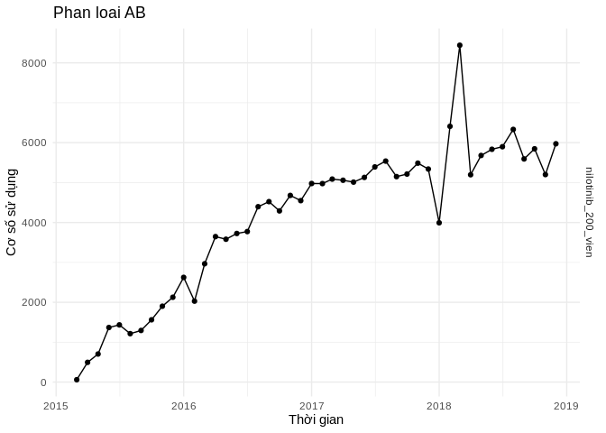

### Bieu do (dua vao bai viet)

``` r
bieudo_coso_phanloai("AA")
```


``` r
bieudo_coso_phanloai("AB")
```



``` r
bieudo_coso_phanloai("AC")
```


``` r
bieudo_coso_phanloai("BB")
```


``` r
bieudo_coso_phanloai("BC")
```


### Bang so lieu thong ke (khong dua vao bai viet)

``` r
vt_hoatchat <- phanloai$hoatchat_dvt[which(phanloai$phanloai != "CC")]
df <- data.frame()
i <- 1
while(i <= 27){
  df_temp <- lay_co_so_thuoc_theo_thoi_gian(vt_hoatchat[i])
  names(df_temp)[2] <- vt_hoatchat[i]
  if(nrow(df) == 0){
    df <- df_temp 
  } else {
    df <- merge(df, df_temp, by.x = "date", by.y = "date", all.x = TRUE)
  }
  
  i <- i + 1
}
df
```

    ##          date sulfamethoxazole_trimethoprim_960_vien
    ## 1  2014-01-01                                   1246
    ## 2  2014-02-01                                    673
    ## 3  2014-03-01                                   2067
    ## 4  2014-04-01                                   2344
    ## 5  2014-05-01                                   2689
    ## 6  2014-06-01                                   1835
    ## 7  2014-07-01                                    819
    ## 8  2014-08-01                                   1992
    ## 9  2014-09-01                                   2315
    ## 10 2014-10-01                                   2986
    ## 11 2014-11-01                                   2806
    ## 12 2014-12-01                                   3102
    ## 13 2015-01-01                                   3094
    ## 14 2015-02-01                                   2735
    ## 15 2015-03-01                                   3533
    ## 16 2015-04-01                                   3215
    ## 17 2015-05-01                                   3228
    ## 18 2015-06-01                                   3214
    ## 19 2015-07-01                                     24
    ## 20 2015-08-01                                   1176
    ## 21 2015-09-01                                   3132
    ## 22 2015-10-01                                   3385
    ## 23 2015-11-01                                   3117
    ## 24 2015-12-01                                   3077
    ## 25 2016-01-01                                   2825
    ## 26 2016-02-01                                   2542
    ## 27 2016-03-01                                   3264
    ## 28 2016-04-01                                   3375
    ## 29 2016-05-01                                   1564
    ## 30 2016-06-01                                   3239
    ## 31 2016-07-01                                   3464
    ## 32 2016-08-01                                   3892
    ## 33 2016-09-01                                   3312
    ## 34 2016-10-01                                   3060
    ## 35 2016-11-01                                   3186
    ## 36 2016-12-01                                   3355
    ## 37 2017-01-01                                   1036
    ## 38 2017-02-01                                      1
    ## 39 2017-03-01                                   1173
    ## 40 2017-04-01                                   1084
    ## 41 2017-05-01                                   1098
    ## 42 2017-06-01                                   1316
    ## 43 2017-07-01                                   2494
    ## 44 2017-08-01                                   3418
    ## 45 2017-09-01                                   3350
    ## 46 2017-10-01                                   3745
    ## 47 2017-11-01                                   4179
    ## 48 2017-12-01                                   4098
    ## 49 2018-01-01                                   4175
    ## 50 2018-02-01                                   3234
    ## 51 2018-03-01                                   4417
    ## 52 2018-04-01                                   4270
    ## 53 2018-05-01                                   4665
    ## 54 2018-06-01                                   4195
    ## 55 2018-07-01                                   4790
    ## 56 2018-08-01                                      8
    ## 57 2018-09-01                                      0
    ## 58 2018-10-01                                   2911
    ## 59 2018-11-01                                   4037
    ## 60 2018-12-01                                   3702
    ##    amox_clavulanac_500_125_vien ciprofloxacin_500_vien
    ## 1                           315                   2291
    ## 2                           964                   1853
    ## 3                          1650                   2727
    ## 4                          1911                   2794
    ## 5                          1666                   2478
    ## 6                          2297                   2707
    ## 7                          2641                   3249
    ## 8                          2319                   2754
    ## 9                          2559                   2478
    ## 10                         2821                   2980
    ## 11                         2572                   3248
    ## 12                          201                   3649
    ## 13                           60                   3000
    ## 14                          903                   2498
    ## 15                         1675                   2787
    ## 16                         1784                   2598
    ## 17                         1871                   2850
    ## 18                         2135                   2749
    ## 19                         2250                   2848
    ## 20                         1878                   2872
    ## 21                         1946                   3076
    ## 22                         2464                   3379
    ## 23                         2597                   3460
    ## 24                         3551                   3382
    ## 25                         3029                   2911
    ## 26                         3416                   3560
    ## 27                         3322                   3390
    ## 28                         4065                   3878
    ## 29                         3543                   2948
    ## 30                         4039                   3232
    ## 31                         4088                   3014
    ## 32                         3871                   3248
    ## 33                         4870                   3472
    ## 34                         4096                   3279
    ## 35                         4994                   3278
    ## 36                         4578                   3318
    ## 37                         3697                   2737
    ## 38                         4885                   2507
    ## 39                         3767                   2795
    ## 40                         3576                   2898
    ## 41                         3524                   4480
    ## 42                         4268                   3375
    ## 43                         5362                   3513
    ## 44                         5366                   4532
    ## 45                         4270                   2975
    ## 46                         5270                   4246
    ## 47                         5071                   3886
    ## 48                         3429                   4209
    ## 49                           NA                   4478
    ## 50                           NA                   3715
    ## 51                            0                   4120
    ## 52                         2721                   3970
    ## 53                         4113                   3661
    ## 54                         4094                   2452
    ## 55                         3875                   1003
    ## 56                         3800                     NA
    ## 57                         4486                    931
    ## 58                         4050                   3308
    ## 59                         4592                   3373
    ## 60                         2711                   3004
    ##    imipenem_+_cilastatin_500_500_lo meropenem_1g_lo
    ## 1                              2983             369
    ## 2                              2171             107
    ## 3                              3455             586
    ## 4                              3071             603
    ## 5                              3406             514
    ## 6                              3871             658
    ## 7                              3144             801
    ## 8                              3106             976
    ## 9                              3319             707
    ## 10                             3811             823
    ## 11                             3429             570
    ## 12                             3002            1114
    ## 13                             1841            1186
    ## 14                             2376            1007
    ## 15                             3655             706
    ## 16                             2909             552
    ## 17                             3743             455
    ## 18                             3172             504
    ## 19                             3861             499
    ## 20                             3294             999
    ## 21                             3740             893
    ## 22                             2389             704
    ## 23                             2874             693
    ## 24                             2531             948
    ## 25                             3210            1031
    ## 26                             1738             472
    ## 27                             2031             866
    ## 28                             2104             903
    ## 29                             2702            1035
    ## 30                             2996             899
    ## 31                             3071             411
    ## 32                             3371             635
    ## 33                             2829             481
    ## 34                             2332             617
    ## 35                             2326             933
    ## 36                             2068             680
    ## 37                             1451             515
    ## 38                             1330             501
    ## 39                             1608             620
    ## 40                             1610             806
    ## 41                             2244             509
    ## 42                             2276             529
    ## 43                             2610             771
    ## 44                             2738            1010
    ## 45                             2680             667
    ## 46                             2997            1002
    ## 47                             2771             737
    ## 48                             2921             575
    ## 49                             2822             752
    ## 50                             2640             996
    ## 51                             2456             930
    ## 52                             3263             785
    ## 53                             3459             739
    ## 54                             2846             830
    ## 55                             3761             703
    ## 56                             2837             985
    ## 57                             2362             767
    ## 58                             2510             790
    ## 59                             2622             410
    ## 60                             2385             891
    ##    natri_clorid_0,9%_500ml_chai kali_clorid_600_vien
    ## 1                          4960                 2155
    ## 2                          4430                 1690
    ## 3                          6679                 2028
    ## 4                          6624                 2538
    ## 5                          6520                 2136
    ## 6                          6717                 2528
    ## 7                          6279                 3169
    ## 8                          6319                 3033
    ## 9                          5941                 2980
    ## 10                         6558                 2806
    ## 11                         6811                 3717
    ## 12                         6904                 3559
    ## 13                         6800                 3552
    ## 14                         5167                 2710
    ## 15                         6632                 2884
    ## 16                         5778                 2904
    ## 17                         5963                 3072
    ## 18                         5887                 3226
    ## 19                         5732                 2625
    ## 20                         7051                 3631
    ## 21                         6299                 2933
    ## 22                         6373                 2905
    ## 23                         6323                 3064
    ## 24                         6014                 3359
    ## 25                         6445                 3276
    ## 26                         4739                 2238
    ## 27                         6080                 2598
    ## 28                         6456                 2831
    ## 29                         6623                 2969
    ## 30                         7225                 3657
    ## 31                         6808                 2231
    ## 32                         7088                 2688
    ## 33                         6403                 2910
    ## 34                         6299                 3573
    ## 35                         6133                 4037
    ## 36                         6737                 3778
    ## 37                         5808                 3376
    ## 38                         5702                 3429
    ## 39                         6298                 3432
    ## 40                         6253                 3179
    ## 41                         6193                 3777
    ## 42                         5869                 3269
    ## 43                         7688                 3248
    ## 44                         6876                 3573
    ## 45                         6662                 3594
    ## 46                         6376                 4017
    ## 47                         6570                 4424
    ## 48                         6454                 4147
    ## 49                         6984                 4060
    ## 50                         5785                 3950
    ## 51                         6981                 4788
    ## 52                         6537                 4067
    ## 53                         6755                 4449
    ## 54                         6574                 4613
    ## 55                         7284                 3842
    ## 56                         7377                 4056
    ## 57                         6349                 2607
    ## 58                         7306                 3265
    ## 59                         7002                 1786
    ## 60                         6760                   NA
    ##    vitamin_b1_b6_b12_vien vitamin_e_400ui_vien spironolacton_25_vien
    ## 1                    3709                993.0                  4291
    ## 2                    2220                106.0                  5260
    ## 3                    4108                963.0                  4354
    ## 4                    9122               1666.0                  4730
    ## 5                    7702               1499.0                  4869
    ## 6                     305               1285.0                  5040
    ## 7                     184                506.0                  5618
    ## 8                   12537               1446.0                  5750
    ## 9                   15789               1935.0                  4971
    ## 10                  16965               1958.0                  5058
    ## 11                  14600               1668.3                  5442
    ## 12                  15468               2040.0                  5678
    ## 13                  10466               1639.0                  3951
    ## 14                   8947               1313.0                  3187
    ## 15                  12563               1808.0                  4536
    ## 16                  11794               1832.0                  3643
    ## 17                  10379               1552.0                  4184
    ## 18                  12282               1989.0                  5095
    ## 19                  13837               2520.0                  5632
    ## 20                  12764               2357.0                  4735
    ## 21                  13284               2699.0                  4407
    ## 22                  14829               3600.7                  5046
    ## 23                  14237               4412.0                  4971
    ## 24                  14064               4132.0                  4601
    ## 25                  13399               3716.0                  3957
    ## 26                  10973               3835.0                  4079
    ## 27                  16562               4719.0                  4487
    ## 28                  14542               4729.0                  3850
    ## 29                  13980               4625.0                  4989
    ## 30                  13891               4932.0                  5304
    ## 31                  15285               5075.0                  5345
    ## 32                  16805               5798.0                  5792
    ## 33                  15962               4915.0                  4442
    ## 34                  15871               4333.0                  4201
    ## 35                  16622               4468.0                  3342
    ## 36                  15837               4291.0                  3496
    ## 37                  12518               3472.0                  3891
    ## 38                  13578               3286.0                  5427
    ## 39                  15513               3127.0                  7267
    ## 40                  14194               3514.0                  6913
    ## 41                  14412               3411.0                 12334
    ## 42                   9945                582.0                  7478
    ## 43                    347                691.0                  7791
    ## 44                    405                590.0                  9423
    ## 45                    579                522.0                  8675
    ## 46                  29745                540.0                  9745
    ## 47                    502                638.0                  9975
    ## 48                    391               1924.0                  8392
    ## 49                     39               2800.0                  7114
    ## 50                     NA               2582.0                  6311
    ## 51                     NA               3381.0                  1970
    ## 52                     NA               2982.0                     0
    ## 53                     NA               3072.0                   841
    ## 54                     NA               3839.0                  7356
    ## 55                     NA               3367.0                  7107
    ## 56                     NA               3263.0                  2496
    ## 57                     60               3852.0                  3630
    ## 58                  11841               4493.0                  9101
    ## 59                  15062               4489.0                  9443
    ## 60                  15670               3421.0                  9300
    ##    methylprednisolon_16_vien methylprednisolon_4_vien dexamethason_4mg_lo
    ## 1                    13949.0                     9154             2102.00
    ## 2                    11392.0                     8595             1908.00
    ## 3                    14535.0                    10101             2514.00
    ## 4                    15479.0                     9821             1823.00
    ## 5                    15363.0                     9480             2182.00
    ## 6                    15640.0                    10747             2113.00
    ## 7                    16020.0                    11154             2358.00
    ## 8                    15557.0                    11462             2158.00
    ## 9                    15595.0                    10608             2889.00
    ## 10                   16549.0                    10019             3512.00
    ## 11                   14533.0                     8525             2703.00
    ## 12                   17212.0                     4225             3118.00
    ## 13                   13045.0                     5760             3379.00
    ## 14                   12662.0                     3815             2528.00
    ## 15                   15824.0                     6892             3570.00
    ## 16                   15669.0                     6146             2842.00
    ## 17                   15174.0                     6831             2851.00
    ## 18                   16491.0                     6768             2617.00
    ## 19                   18283.0                     8888             2520.00
    ## 20                   15187.0                     9846             2419.00
    ## 21                   14455.0                     8195             2442.00
    ## 22                   15781.0                     8692             2566.00
    ## 23                   16687.0                     9566             2438.00
    ## 24                   14932.0                     7919             2015.00
    ## 25                   13356.0                     7453             1880.00
    ## 26                   12592.0                     7463             1895.00
    ## 27                   15620.0                     9291             1819.00
    ## 28                   15695.0                     8665             2043.00
    ## 29                   17227.0                     9318             2038.00
    ## 30                   17642.0                    10300             1879.25
    ## 31                   16192.0                    10578             2242.00
    ## 32                   17198.0                    12087             2119.00
    ## 33                   14962.0                    10224             2482.00
    ## 34                   14228.0                     9429             2833.00
    ## 35                   14807.0                     9077             2283.00
    ## 36                   16961.0                    10808             2521.00
    ## 37                   14407.0                     8877             2429.00
    ## 38                   16381.0                    10702             1856.00
    ## 39                   16744.0                    13224             2245.00
    ## 40                   14107.0                    11499             2123.00
    ## 41                   13196.0                    13166             1663.00
    ## 42                   14942.0                    12695             1912.00
    ## 43                   15985.0                    12717             2681.00
    ## 44                   18639.0                    13529             2348.00
    ## 45                   15853.0                    14598             2046.75
    ## 46                   15168.0                    15588             2280.00
    ## 47                   17182.0                    15096             1517.00
    ## 48                   16573.0                    15576             2088.00
    ## 49                   14168.0                    13089             2724.00
    ## 50                   12192.0                    12029             2060.00
    ## 51                   17693.0                    17907             3179.00
    ## 52                   15872.0                    15096             2424.00
    ## 53                   18459.0                    21540             2190.00
    ## 54                   17665.0                    15933             2870.00
    ## 55                   16804.5                        2             2861.00
    ## 56                   18058.0                     4386             3412.00
    ## 57                   14588.0                    12057             2578.00
    ## 58                   17005.5                    16335             3080.00
    ## 59                   16356.0                    36330             3955.00
    ## 60                   15434.0                    13510             3120.00
    ##    deferipron_500mg_vien acidfolic_5_vien deferasirox_250_vien
    ## 1                  40795            50174                 4383
    ## 2                  65010            43441                 3919
    ## 3                  71916            46361                 5435
    ## 4                  68129            46059                 5190
    ## 5                  66103            41012                 4968
    ## 6                  79162            25380                 6951
    ## 7                  79859                0                 8073
    ## 8                  81597            47586                 6882
    ## 9                  74626            52479                 5996
    ## 10                 77532            60967                 7344
    ## 11                 69087            56144                 6818
    ## 12                 73603            57073                 8496
    ## 13                 58458            39492                 6922
    ## 14                 43842            32334                 7211
    ## 15                 74428            42799                 7642
    ## 16                 67713            40936                 7195
    ## 17                 71870            40890                 7535
    ## 18                 76003            45059                 8542
    ## 19                 80149            51293                10379
    ## 20                 76765            48235                 9654
    ## 21                 71769            47100                 8974
    ## 22                 79391            53063                 9600
    ## 23                 79814            50547                 9505
    ## 24                 69571            45496                10382
    ## 25                 70541            43451                 8875
    ## 26                 68307            41485                 9568
    ## 27                 84206            50930                11213
    ## 28                 77914            46904                11385
    ## 29                 80126            48217                12293
    ## 30                 80824            51107                16683
    ## 31                 76254            54542                16556
    ## 32                 83906            60505                25218
    ## 33                 73291            54539                20688
    ## 34                 79759            53714                15071
    ## 35                 90701            57179                 1881
    ## 36                 64639            56042                13693
    ## 37                 67374            49763                15697
    ## 38                 75578            55616                16477
    ## 39                 80482            61808                19027
    ## 40                 78441            57267                18070
    ## 41                 81279            61043                18773
    ## 42                 81046            56951                20323
    ## 43                 77514            12644                20055
    ## 44                 94195               NA                12954
    ## 45                 79711               NA                15265
    ## 46                 78403               NA                18565
    ## 47                 78957               NA                18515
    ## 48                 79733               NA                18479
    ## 49                 74370             7852                15591
    ## 50                 69407            36096                12215
    ## 51                 90882            47341                16177
    ## 52                 86677            43984                16353
    ## 53                 89993            49358                17521
    ## 54                 82803            43886                15608
    ## 55                 80311            53224                16159
    ## 56                 87220            57304                16710
    ## 57                 74455            50793                13897
    ## 58                 80510            56621                14515
    ## 59                 81735            54350                14577
    ## 60                 73351            50332                14130
    ##    omeprazol_20_vien guaiazulen_dimethicon_goi
    ## 1               7345                        NA
    ## 2               7026                        NA
    ## 3               9568                        NA
    ## 4               9594                        NA
    ## 5               9871                        NA
    ## 6               9974                        NA
    ## 7              10772                        NA
    ## 8              11029                        NA
    ## 9              10597                        NA
    ## 10              9576                        NA
    ## 11              6429                        NA
    ## 12              6185                        NA
    ## 13              5011                        NA
    ## 14              4862                        NA
    ## 15              7649                        NA
    ## 16              7100                        NA
    ## 17              7563                        NA
    ## 18             11542                        NA
    ## 19             12789                        NA
    ## 20               955                         0
    ## 21              1589                       656
    ## 22              7132                      1939
    ## 23              7271                      2603
    ## 24              6483                      2582
    ## 25              5890                      3206
    ## 26              5353                      2641
    ## 27              6172                      3284
    ## 28              6261                      3887
    ## 29              8814                      4118
    ## 30              8977                      4788
    ## 31              8233                      4847
    ## 32              9630                      5075
    ## 33             11078                      4990
    ## 34              9506                      4100
    ## 35              9444                      3698
    ## 36              9456                      3652
    ## 37              9801                      3757
    ## 38              9179                      4958
    ## 39             11331                      5284
    ## 40             10685                      4581
    ## 41             10254                      4422
    ## 42             10688                      5329
    ## 43             10830                      5763
    ## 44             13073                      6803
    ## 45             11054                      6490
    ## 46             11611                      5950
    ## 47             12972                      5874
    ## 48             11953                      5293
    ## 49             10857                      5795
    ## 50              9243                      4123
    ## 51             12453                      5481
    ## 52             11206                      5797
    ## 53             12982                      5994
    ## 54             10022                      5533
    ## 55               905                         7
    ## 56                76                      1865
    ## 57              5847                      1948
    ## 58             10961                      2684
    ## 59             12523                      3470
    ## 60              1750                      1124
    ##    diosmine_hesperidin_450_50_vien hydroxycarbamid_500_vien
    ## 1                             8573                    26811
    ## 2                             6060                    23228
    ## 3                             7499                    26560
    ## 4                             6533                    25612
    ## 5                             5702                    24600
    ## 6                             1184                    23925
    ## 7                              357                    17433
    ## 8                             5441                    22491
    ## 9                             6791                    25686
    ## 10                            6368                    28326
    ## 11                            6722                    25632
    ## 12                            7061                    26371
    ## 13                            4560                    20672
    ## 14                            2994                    17293
    ## 15                            5859                    22678
    ## 16                            5614                    20451
    ## 17                            5894                    23636
    ## 18                            5864                    23282
    ## 19                            7338                    24728
    ## 20                            1186                    23804
    ## 21                            1744                    23004
    ## 22                            5695                    23417
    ## 23                            5392                    22163
    ## 24                            5883                    22378
    ## 25                            4775                    22109
    ## 26                            4882                    19588
    ## 27                            6768                    28700
    ## 28                            6599                    25901
    ## 29                            6960                    25364
    ## 30                            6819                    25791
    ## 31                            7935                    26508
    ## 32                            8547                    30191
    ## 33                            3955                    30451
    ## 34                            4685                    27887
    ## 35                            4944                    28541
    ## 36                            5937                   136424
    ## 37                            4972                    27800
    ## 38                            4674                    29448
    ## 39                            4590                    35722
    ## 40                            4422                    34325
    ## 41                            4794                    37136
    ## 42                            4733                    36757
    ## 43                            5238                    38582
    ## 44                            5021                    40693
    ## 45                            4151                    37927
    ## 46                            4660                    36925
    ## 47                            3944                    39799
    ## 48                            3781                    37056
    ## 49                            3477                    37019
    ## 50                            3365                    30798
    ## 51                            4418                    40808
    ## 52                            3907                    42786
    ## 53                            6080                    27355
    ## 54                            3957                      240
    ## 55                            2813                    33622
    ## 56                            2773                    45723
    ## 57                            2792                    41530
    ## 58                            3781                    29127
    ## 59                            3313                      212
    ## 60                            2208                    36177
    ##    imatinib_100_vien mercaptopurin_50_vien nilotinib_200_vien
    ## 1               4693                  9029                 NA
    ## 2               2949                  8514                 NA
    ## 3               3970                  9591                 NA
    ## 4               4624                  9234                 NA
    ## 5               4521                  9532                 NA
    ## 6               4454                  9616                 NA
    ## 7               5029                 10455                 NA
    ## 8               4869                 10130                 NA
    ## 9               4815                  9688                 NA
    ## 10              5296                 11095                 NA
    ## 11              4774                  9689                 NA
    ## 12              5212                 11076                 NA
    ## 13              5683                  8972                 NA
    ## 14              5700                  8621                 NA
    ## 15              6100                 11095                 60
    ## 16              6172                  9389                495
    ## 17              5872                  8107                704
    ## 18              6076                  8470               1368
    ## 19              6448                 11956               1434
    ## 20              6436                 10000               1214
    ## 21              6457                 10080               1294
    ## 22              7392                 10530               1561
    ## 23              7127                 10547               1902
    ## 24              7385                 10494               2126
    ## 25              8139                  9827               2624
    ## 26              6948                  9840               2029
    ## 27              8690                 13281               2965
    ## 28              9279                 12055               3646
    ## 29              8713                 11018               3580
    ## 30              9683                 12732               3724
    ## 31              9439                 11357               3772
    ## 32             10964                 13725               4395
    ## 33             10895                 13008               4522
    ## 34             10397                 12701               4290
    ## 35             10578                 12685               4678
    ## 36             10820                 11612               4547
    ## 37             11677                  9818               4976
    ## 38             11407                 11396               4974
    ## 39             12402                 13412               5087
    ## 40             12292                 11522               5058
    ## 41             12675                 11396               5011
    ## 42             11826                  9862               5129
    ## 43             16025                  7039               5392
    ## 44             17775                  2272               5538
    ## 45             18228                  6599               5149
    ## 46             19515                 11057               5213
    ## 47             17109                 11385               5486
    ## 48             19217                 11070               5339
    ## 49             21509                 11387               3992
    ## 50             19150                  9743               6409
    ## 51             54921                 11754               8441
    ## 52             34318                 10453               5196
    ## 53             22413                 11026               5679
    ## 54             22261                    11               5834
    ## 55             22705                    NA               5898
    ## 56             27057                    NA               6332
    ## 57             20149                    NA               5592
    ## 58             23867                  8177               5846
    ## 59             22031                 11002               5200
    ## 60             23278                 11666               5972
    ##    methotrexat_2,5mg_vien bortezomib_1mg_lo bortezomib_3,5mg_lo
    ## 1                      NA                NA                  62
    ## 2                      NA                NA                  54
    ## 3                    2145                NA                  57
    ## 4                    4687                NA                  47
    ## 5                    4955                NA                  51
    ## 6                    1731                NA                  44
    ## 7                      47                NA                  39
    ## 8                    1112                NA                  54
    ## 9                    5013                NA                  66
    ## 10                   5736                NA                  91
    ## 11                   4721                NA                  60
    ## 12                   5823                NA                  76
    ## 13                   4529                NA                  90
    ## 14                   4437                NA                  61
    ## 15                   5806                NA                  92
    ## 16                   4842                NA                  77
    ## 17                   5172                NA                  69
    ## 18                   5885                NA                  81
    ## 19                   5621                NA                  87
    ## 20                   4982                NA                  75
    ## 21                   4964                NA                  61
    ## 22                   5279                NA                  80
    ## 23                   4787                NA                  65
    ## 24                   4101                NA                  59
    ## 25                   3947                NA                  46
    ## 26                   3916                NA                  60
    ## 27                   5924                NA                  59
    ## 28                   6130                NA                  58
    ## 29                   5391                NA                  50
    ## 30                   6297                NA                  49
    ## 31                   5489                NA                  60
    ## 32                   5314                NA                  59
    ## 33                   5574                NA                  74
    ## 34                   5913                NA                  77
    ## 35                   6061                NA                  62
    ## 36                   2824                NA                  69
    ## 37                      0                NA                  62
    ## 38                      0                NA                  61
    ## 39                      0                NA                  59
    ## 40                      0                11                  51
    ## 41                   1569                53                  28
    ## 42                   4848               107                  18
    ## 43                   4662               119                  34
    ## 44                   2720                67                  28
    ## 45                      4                68                  42
    ## 46                      0                84                  39
    ## 47                      0                74                  20
    ## 48                      0               132                  17
    ## 49                    726               168                  30
    ## 50                   1686               102                  23
    ## 51                   5641               207                  32
    ## 52                   5224               136                  28
    ## 53                   5673                72                  46
    ## 54                   5726                21                  93
    ## 55                   5880               123                  45
    ## 56                   4442               147                  37
    ## 57                    125               148                  18
    ## 58                   4346               122                  44
    ## 59                   5653               129                  65
    ## 60                   5439                60                  61
    ##    rituximab_500mg_50ml_lo
    ## 1                       13
    ## 2                       13
    ## 3                       15
    ## 4                       15
    ## 5                       10
    ## 6                       11
    ## 7                       17
    ## 8                       12
    ## 9                       13
    ## 10                      13
    ## 11                       9
    ## 12                       8
    ## 13                      17
    ## 14                      15
    ## 15                      16
    ## 16                      18
    ## 17                      22
    ## 18                      15
    ## 19                      13
    ## 20                       9
    ## 21                      11
    ## 22                      10
    ## 23                      18
    ## 24                      15
    ## 25                      17
    ## 26                      18
    ## 27                      18
    ## 28                      18
    ## 29                      20
    ## 30                      21
    ## 31                      21
    ## 32                      24
    ## 33                      24
    ## 34                      23
    ## 35                      24
    ## 36                      36
    ## 37                      19
    ## 38                      24
    ## 39                      33
    ## 40                      22
    ## 41                      19
    ## 42                      25
    ## 43                      19
    ## 44                      26
    ## 45                      27
    ## 46                      31
    ## 47                      24
    ## 48                      22
    ## 49                      34
    ## 50                      17
    ## 51                      39
    ## 52                      25
    ## 53                      39
    ## 54                      39
    ## 55                      31
    ## 56                      37
    ## 57                      27
    ## 58                      39
    ## 59                      31
    ## 60                      24
