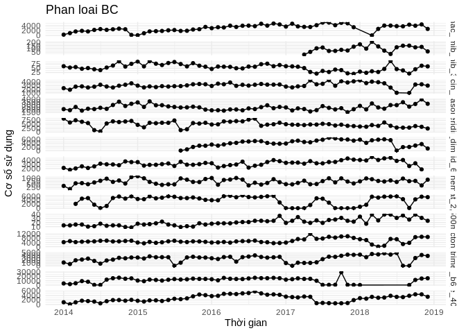

``` r
lay_co_so_thuoc_theo_thoi_gian <- function(hoatchat){
  tonghop %>%
    filter(hoatchat_dvt == !!hoatchat) %>%
    select(c("xuattrongky_sl", "nam", "thang")) %>%
    mutate(date = as.Date(str_c(nam, thang, "01", sep = "-"))) %>%
    group_by(date) %>%
    summarise(coso = sum(xuattrongky_sl)) %>%
    arrange(date)  
}

ve_bieu_do_hc_theo_thoi_gian <- function(data){
data %>%
  ggplot(aes(x=date, y=coso)) +
    geom_line() +
    geom_point() +
    xlab("Thời gian") + 
    scale_x_date(date_breaks = "1 year", labels = date_format("%Y")) +
    ylab("Cơ số sử dụng") + 
    theme_minimal()
}

bieudo_coso_phanloai <- function(pl){
  vt_hoatchat <- phanloai$hoatchat_dvt[which(phanloai$phanloai == pl)]
  df <- data.frame()
  i <- 1
  while(i <= length(vt_hoatchat)){
    df_hoatchat <- lay_co_so_thuoc_theo_thoi_gian(vt_hoatchat[i]) %>%
      mutate(hoatchat = vt_hoatchat[i])
    df <- rbind(df, df_hoatchat)
    i <- i + 1
  }
  df %>%
    ggplot(aes(x = date, y = coso)) + 
    geom_line() + 
    facet_grid(hoatchat ~ ., scales = "free_y") + theme(legend.position = "none") +
    geom_point() +
    xlab("Thời gian") + 
    scale_x_date(date_breaks = "1 year", labels = date_format("%Y")) +
    ylab("Cơ số sử dụng") + 
    theme_minimal() +
    ggtitle(label = str_c("Phan loai ", pl))
}
```

``` r
bieudo_coso_phanloai("AA")
```


``` r
bieudo_coso_phanloai("AB")
```


``` r
bieudo_coso_phanloai("AC")
```


``` r
bieudo_coso_phanloai("BB")
```


``` r
bieudo_coso_phanloai("BC")
```



``` r
df1 <- lay_co_so_thuoc_theo_thoi_gian("deferasirox_250_vien") %>% mutate(nhom = "deferasirox_250_vien")
df2 <- lay_co_so_thuoc_theo_thoi_gian("imatinib_100_vien") %>% mutate(nhom = "imatinib_100_vien")
# df <- merge(df1, df2, by.x = "date", by.y="date")

df <- rbind(df1, df2)
df %>%
  ggplot(aes(x = date, y = coso)) + 
  geom_line() + 
  facet_grid(nhom ~ ., scales = "free_y") + theme(legend.position = "none") +
  geom_point() +
  xlab("Thời gian") + 
  scale_x_date(date_breaks = "1 year", labels = date_format("%Y")) +
  ylab("Cơ số sử dụng") + 
  theme_minimal()
```


