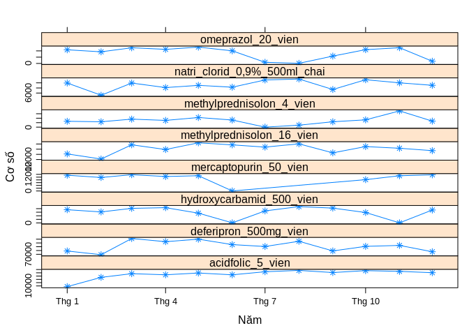
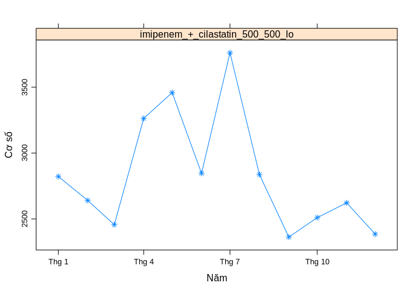

### Bieu do (dua vao bai viet)

``` r
bieudo_coso_phanloai("AA")
```


``` r
bieudo_coso_phanloai("AB")
```


``` r
bieudo_coso_phanloai("AC")
```



``` r
bieudo_coso_phanloai("BB")
```



``` r
bieudo_coso_phanloai("BC")
```


### Bang so lieu thong ke (khong dua vao bai viet)

``` r
knitr::kable(df, format="html", 
             col.names = names(df))
```

<table>
<thead>
<tr>
<th style="text-align:left;">
date
</th>
<th style="text-align:right;">
sulfamethoxazole\_trimethoprim\_960\_vien
</th>
<th style="text-align:right;">
amox\_clavulanac\_500\_125\_vien
</th>
<th style="text-align:right;">
ciprofloxacin\_500\_vien
</th>
<th style="text-align:right;">
imipenem\_+\_cilastatin\_500\_500\_lo
</th>
<th style="text-align:right;">
meropenem\_1g\_lo
</th>
<th style="text-align:right;">
natri\_clorid\_0,9%\_500ml\_chai
</th>
<th style="text-align:right;">
kali\_clorid\_600\_vien
</th>
<th style="text-align:right;">
vitamin\_b1\_b6\_b12\_vien
</th>
<th style="text-align:right;">
vitamin\_e\_400ui\_vien
</th>
<th style="text-align:right;">
spironolacton\_25\_vien
</th>
<th style="text-align:right;">
methylprednisolon\_16\_vien
</th>
<th style="text-align:right;">
methylprednisolon\_4\_vien
</th>
<th style="text-align:right;">
dexamethason\_4mg\_lo
</th>
<th style="text-align:right;">
deferipron\_500mg\_vien
</th>
<th style="text-align:right;">
acidfolic\_5\_vien
</th>
<th style="text-align:right;">
deferasirox\_250\_vien
</th>
<th style="text-align:right;">
omeprazol\_20\_vien
</th>
<th style="text-align:right;">
guaiazulen\_dimethicon\_goi
</th>
<th style="text-align:right;">
diosmine\_hesperidin\_450\_50\_vien
</th>
<th style="text-align:right;">
hydroxycarbamid\_500\_vien
</th>
<th style="text-align:right;">
imatinib\_100\_vien
</th>
<th style="text-align:right;">
mercaptopurin\_50\_vien
</th>
<th style="text-align:right;">
nilotinib\_200\_vien
</th>
<th style="text-align:right;">
methotrexat\_2,5mg\_vien
</th>
<th style="text-align:right;">
bortezomib\_1mg\_lo
</th>
<th style="text-align:right;">
bortezomib\_3,5mg\_lo
</th>
<th style="text-align:right;">
rituximab\_500mg\_50ml\_lo
</th>
</tr>
</thead>
<tbody>
<tr>
<td style="text-align:left;">
2018-01-01
</td>
<td style="text-align:right;">
4175
</td>
<td style="text-align:right;">
NA
</td>
<td style="text-align:right;">
4478
</td>
<td style="text-align:right;">
2822
</td>
<td style="text-align:right;">
752
</td>
<td style="text-align:right;">
6984
</td>
<td style="text-align:right;">
4060
</td>
<td style="text-align:right;">
39
</td>
<td style="text-align:right;">
2800
</td>
<td style="text-align:right;">
7114
</td>
<td style="text-align:right;">
14168.0
</td>
<td style="text-align:right;">
13089
</td>
<td style="text-align:right;">
2724
</td>
<td style="text-align:right;">
74370
</td>
<td style="text-align:right;">
7852
</td>
<td style="text-align:right;">
15591
</td>
<td style="text-align:right;">
10857
</td>
<td style="text-align:right;">
5795
</td>
<td style="text-align:right;">
3477
</td>
<td style="text-align:right;">
37019
</td>
<td style="text-align:right;">
21509
</td>
<td style="text-align:right;">
11387
</td>
<td style="text-align:right;">
3992
</td>
<td style="text-align:right;">
726
</td>
<td style="text-align:right;">
168
</td>
<td style="text-align:right;">
30
</td>
<td style="text-align:right;">
34
</td>
</tr>
<tr>
<td style="text-align:left;">
2018-02-01
</td>
<td style="text-align:right;">
3234
</td>
<td style="text-align:right;">
NA
</td>
<td style="text-align:right;">
3715
</td>
<td style="text-align:right;">
2640
</td>
<td style="text-align:right;">
996
</td>
<td style="text-align:right;">
5785
</td>
<td style="text-align:right;">
3950
</td>
<td style="text-align:right;">
NA
</td>
<td style="text-align:right;">
2582
</td>
<td style="text-align:right;">
6311
</td>
<td style="text-align:right;">
12192.0
</td>
<td style="text-align:right;">
12029
</td>
<td style="text-align:right;">
2060
</td>
<td style="text-align:right;">
69407
</td>
<td style="text-align:right;">
36096
</td>
<td style="text-align:right;">
12215
</td>
<td style="text-align:right;">
9243
</td>
<td style="text-align:right;">
4123
</td>
<td style="text-align:right;">
3365
</td>
<td style="text-align:right;">
30798
</td>
<td style="text-align:right;">
19150
</td>
<td style="text-align:right;">
9743
</td>
<td style="text-align:right;">
6409
</td>
<td style="text-align:right;">
1686
</td>
<td style="text-align:right;">
102
</td>
<td style="text-align:right;">
23
</td>
<td style="text-align:right;">
17
</td>
</tr>
<tr>
<td style="text-align:left;">
2018-03-01
</td>
<td style="text-align:right;">
4417
</td>
<td style="text-align:right;">
0
</td>
<td style="text-align:right;">
4120
</td>
<td style="text-align:right;">
2456
</td>
<td style="text-align:right;">
930
</td>
<td style="text-align:right;">
6981
</td>
<td style="text-align:right;">
4788
</td>
<td style="text-align:right;">
NA
</td>
<td style="text-align:right;">
3381
</td>
<td style="text-align:right;">
1970
</td>
<td style="text-align:right;">
17693.0
</td>
<td style="text-align:right;">
17907
</td>
<td style="text-align:right;">
3179
</td>
<td style="text-align:right;">
90882
</td>
<td style="text-align:right;">
47341
</td>
<td style="text-align:right;">
16177
</td>
<td style="text-align:right;">
12453
</td>
<td style="text-align:right;">
5481
</td>
<td style="text-align:right;">
4418
</td>
<td style="text-align:right;">
40808
</td>
<td style="text-align:right;">
54921
</td>
<td style="text-align:right;">
11754
</td>
<td style="text-align:right;">
8441
</td>
<td style="text-align:right;">
5641
</td>
<td style="text-align:right;">
207
</td>
<td style="text-align:right;">
32
</td>
<td style="text-align:right;">
39
</td>
</tr>
<tr>
<td style="text-align:left;">
2018-04-01
</td>
<td style="text-align:right;">
4270
</td>
<td style="text-align:right;">
2721
</td>
<td style="text-align:right;">
3970
</td>
<td style="text-align:right;">
3263
</td>
<td style="text-align:right;">
785
</td>
<td style="text-align:right;">
6537
</td>
<td style="text-align:right;">
4067
</td>
<td style="text-align:right;">
NA
</td>
<td style="text-align:right;">
2982
</td>
<td style="text-align:right;">
0
</td>
<td style="text-align:right;">
15872.0
</td>
<td style="text-align:right;">
15096
</td>
<td style="text-align:right;">
2424
</td>
<td style="text-align:right;">
86677
</td>
<td style="text-align:right;">
43984
</td>
<td style="text-align:right;">
16353
</td>
<td style="text-align:right;">
11206
</td>
<td style="text-align:right;">
5797
</td>
<td style="text-align:right;">
3907
</td>
<td style="text-align:right;">
42786
</td>
<td style="text-align:right;">
34318
</td>
<td style="text-align:right;">
10453
</td>
<td style="text-align:right;">
5196
</td>
<td style="text-align:right;">
5224
</td>
<td style="text-align:right;">
136
</td>
<td style="text-align:right;">
28
</td>
<td style="text-align:right;">
25
</td>
</tr>
<tr>
<td style="text-align:left;">
2018-05-01
</td>
<td style="text-align:right;">
4665
</td>
<td style="text-align:right;">
4113
</td>
<td style="text-align:right;">
3661
</td>
<td style="text-align:right;">
3459
</td>
<td style="text-align:right;">
739
</td>
<td style="text-align:right;">
6755
</td>
<td style="text-align:right;">
4449
</td>
<td style="text-align:right;">
NA
</td>
<td style="text-align:right;">
3072
</td>
<td style="text-align:right;">
841
</td>
<td style="text-align:right;">
18459.0
</td>
<td style="text-align:right;">
21540
</td>
<td style="text-align:right;">
2190
</td>
<td style="text-align:right;">
89993
</td>
<td style="text-align:right;">
49358
</td>
<td style="text-align:right;">
17521
</td>
<td style="text-align:right;">
12982
</td>
<td style="text-align:right;">
5994
</td>
<td style="text-align:right;">
6080
</td>
<td style="text-align:right;">
27355
</td>
<td style="text-align:right;">
22413
</td>
<td style="text-align:right;">
11026
</td>
<td style="text-align:right;">
5679
</td>
<td style="text-align:right;">
5673
</td>
<td style="text-align:right;">
72
</td>
<td style="text-align:right;">
46
</td>
<td style="text-align:right;">
39
</td>
</tr>
<tr>
<td style="text-align:left;">
2018-06-01
</td>
<td style="text-align:right;">
4195
</td>
<td style="text-align:right;">
4094
</td>
<td style="text-align:right;">
2452
</td>
<td style="text-align:right;">
2846
</td>
<td style="text-align:right;">
830
</td>
<td style="text-align:right;">
6574
</td>
<td style="text-align:right;">
4613
</td>
<td style="text-align:right;">
NA
</td>
<td style="text-align:right;">
3839
</td>
<td style="text-align:right;">
7356
</td>
<td style="text-align:right;">
17665.0
</td>
<td style="text-align:right;">
15933
</td>
<td style="text-align:right;">
2870
</td>
<td style="text-align:right;">
82803
</td>
<td style="text-align:right;">
43886
</td>
<td style="text-align:right;">
15608
</td>
<td style="text-align:right;">
10022
</td>
<td style="text-align:right;">
5533
</td>
<td style="text-align:right;">
3957
</td>
<td style="text-align:right;">
240
</td>
<td style="text-align:right;">
22261
</td>
<td style="text-align:right;">
11
</td>
<td style="text-align:right;">
5834
</td>
<td style="text-align:right;">
5726
</td>
<td style="text-align:right;">
21
</td>
<td style="text-align:right;">
93
</td>
<td style="text-align:right;">
39
</td>
</tr>
<tr>
<td style="text-align:left;">
2018-07-01
</td>
<td style="text-align:right;">
4790
</td>
<td style="text-align:right;">
3875
</td>
<td style="text-align:right;">
1003
</td>
<td style="text-align:right;">
3761
</td>
<td style="text-align:right;">
703
</td>
<td style="text-align:right;">
7284
</td>
<td style="text-align:right;">
3842
</td>
<td style="text-align:right;">
NA
</td>
<td style="text-align:right;">
3367
</td>
<td style="text-align:right;">
7107
</td>
<td style="text-align:right;">
16804.5
</td>
<td style="text-align:right;">
2
</td>
<td style="text-align:right;">
2861
</td>
<td style="text-align:right;">
80311
</td>
<td style="text-align:right;">
53224
</td>
<td style="text-align:right;">
16159
</td>
<td style="text-align:right;">
905
</td>
<td style="text-align:right;">
7
</td>
<td style="text-align:right;">
2813
</td>
<td style="text-align:right;">
33622
</td>
<td style="text-align:right;">
22705
</td>
<td style="text-align:right;">
NA
</td>
<td style="text-align:right;">
5898
</td>
<td style="text-align:right;">
5880
</td>
<td style="text-align:right;">
123
</td>
<td style="text-align:right;">
45
</td>
<td style="text-align:right;">
31
</td>
</tr>
<tr>
<td style="text-align:left;">
2018-08-01
</td>
<td style="text-align:right;">
8
</td>
<td style="text-align:right;">
3800
</td>
<td style="text-align:right;">
NA
</td>
<td style="text-align:right;">
2837
</td>
<td style="text-align:right;">
985
</td>
<td style="text-align:right;">
7377
</td>
<td style="text-align:right;">
4056
</td>
<td style="text-align:right;">
NA
</td>
<td style="text-align:right;">
3263
</td>
<td style="text-align:right;">
2496
</td>
<td style="text-align:right;">
18058.0
</td>
<td style="text-align:right;">
4386
</td>
<td style="text-align:right;">
3412
</td>
<td style="text-align:right;">
87220
</td>
<td style="text-align:right;">
57304
</td>
<td style="text-align:right;">
16710
</td>
<td style="text-align:right;">
76
</td>
<td style="text-align:right;">
1865
</td>
<td style="text-align:right;">
2773
</td>
<td style="text-align:right;">
45723
</td>
<td style="text-align:right;">
27057
</td>
<td style="text-align:right;">
NA
</td>
<td style="text-align:right;">
6332
</td>
<td style="text-align:right;">
4442
</td>
<td style="text-align:right;">
147
</td>
<td style="text-align:right;">
37
</td>
<td style="text-align:right;">
37
</td>
</tr>
<tr>
<td style="text-align:left;">
2018-09-01
</td>
<td style="text-align:right;">
0
</td>
<td style="text-align:right;">
4486
</td>
<td style="text-align:right;">
931
</td>
<td style="text-align:right;">
2362
</td>
<td style="text-align:right;">
767
</td>
<td style="text-align:right;">
6349
</td>
<td style="text-align:right;">
2607
</td>
<td style="text-align:right;">
60
</td>
<td style="text-align:right;">
3852
</td>
<td style="text-align:right;">
3630
</td>
<td style="text-align:right;">
14588.0
</td>
<td style="text-align:right;">
12057
</td>
<td style="text-align:right;">
2578
</td>
<td style="text-align:right;">
74455
</td>
<td style="text-align:right;">
50793
</td>
<td style="text-align:right;">
13897
</td>
<td style="text-align:right;">
5847
</td>
<td style="text-align:right;">
1948
</td>
<td style="text-align:right;">
2792
</td>
<td style="text-align:right;">
41530
</td>
<td style="text-align:right;">
20149
</td>
<td style="text-align:right;">
NA
</td>
<td style="text-align:right;">
5592
</td>
<td style="text-align:right;">
125
</td>
<td style="text-align:right;">
148
</td>
<td style="text-align:right;">
18
</td>
<td style="text-align:right;">
27
</td>
</tr>
<tr>
<td style="text-align:left;">
2018-10-01
</td>
<td style="text-align:right;">
2911
</td>
<td style="text-align:right;">
4050
</td>
<td style="text-align:right;">
3308
</td>
<td style="text-align:right;">
2510
</td>
<td style="text-align:right;">
790
</td>
<td style="text-align:right;">
7306
</td>
<td style="text-align:right;">
3265
</td>
<td style="text-align:right;">
11841
</td>
<td style="text-align:right;">
4493
</td>
<td style="text-align:right;">
9101
</td>
<td style="text-align:right;">
17005.5
</td>
<td style="text-align:right;">
16335
</td>
<td style="text-align:right;">
3080
</td>
<td style="text-align:right;">
80510
</td>
<td style="text-align:right;">
56621
</td>
<td style="text-align:right;">
14515
</td>
<td style="text-align:right;">
10961
</td>
<td style="text-align:right;">
2684
</td>
<td style="text-align:right;">
3781
</td>
<td style="text-align:right;">
29127
</td>
<td style="text-align:right;">
23867
</td>
<td style="text-align:right;">
8177
</td>
<td style="text-align:right;">
5846
</td>
<td style="text-align:right;">
4346
</td>
<td style="text-align:right;">
122
</td>
<td style="text-align:right;">
44
</td>
<td style="text-align:right;">
39
</td>
</tr>
<tr>
<td style="text-align:left;">
2018-11-01
</td>
<td style="text-align:right;">
4037
</td>
<td style="text-align:right;">
4592
</td>
<td style="text-align:right;">
3373
</td>
<td style="text-align:right;">
2622
</td>
<td style="text-align:right;">
410
</td>
<td style="text-align:right;">
7002
</td>
<td style="text-align:right;">
1786
</td>
<td style="text-align:right;">
15062
</td>
<td style="text-align:right;">
4489
</td>
<td style="text-align:right;">
9443
</td>
<td style="text-align:right;">
16356.0
</td>
<td style="text-align:right;">
36330
</td>
<td style="text-align:right;">
3955
</td>
<td style="text-align:right;">
81735
</td>
<td style="text-align:right;">
54350
</td>
<td style="text-align:right;">
14577
</td>
<td style="text-align:right;">
12523
</td>
<td style="text-align:right;">
3470
</td>
<td style="text-align:right;">
3313
</td>
<td style="text-align:right;">
212
</td>
<td style="text-align:right;">
22031
</td>
<td style="text-align:right;">
11002
</td>
<td style="text-align:right;">
5200
</td>
<td style="text-align:right;">
5653
</td>
<td style="text-align:right;">
129
</td>
<td style="text-align:right;">
65
</td>
<td style="text-align:right;">
31
</td>
</tr>
<tr>
<td style="text-align:left;">
2018-12-01
</td>
<td style="text-align:right;">
3702
</td>
<td style="text-align:right;">
2711
</td>
<td style="text-align:right;">
3004
</td>
<td style="text-align:right;">
2385
</td>
<td style="text-align:right;">
891
</td>
<td style="text-align:right;">
6760
</td>
<td style="text-align:right;">
NA
</td>
<td style="text-align:right;">
15670
</td>
<td style="text-align:right;">
3421
</td>
<td style="text-align:right;">
9300
</td>
<td style="text-align:right;">
15434.0
</td>
<td style="text-align:right;">
13510
</td>
<td style="text-align:right;">
3120
</td>
<td style="text-align:right;">
73351
</td>
<td style="text-align:right;">
50332
</td>
<td style="text-align:right;">
14130
</td>
<td style="text-align:right;">
1750
</td>
<td style="text-align:right;">
1124
</td>
<td style="text-align:right;">
2208
</td>
<td style="text-align:right;">
36177
</td>
<td style="text-align:right;">
23278
</td>
<td style="text-align:right;">
11666
</td>
<td style="text-align:right;">
5972
</td>
<td style="text-align:right;">
5439
</td>
<td style="text-align:right;">
60
</td>
<td style="text-align:right;">
61
</td>
<td style="text-align:right;">
24
</td>
</tr>
</tbody>
</table>
